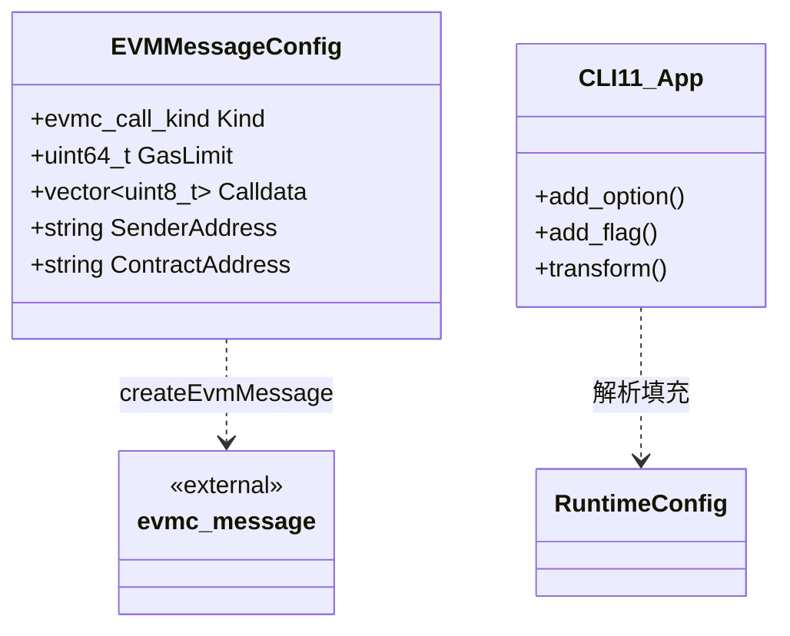

# cli 模块数据模型

## 实体关系图 (Mermaid classDiagram)

说明：`EVMMessageConfig` 为 cli 模块内定义的 DTO，用于构造 `evmc_message`；`CLI11_App` 代表 CLI11 解析器，将命令行参数映射到内部类型。

## 核心实体

### EVMMessageConfig

仅在 `ZEN_ENABLE_EVM` 下使用，位于 `src/cli/dtvm.cpp` 中的局部结构体，用于描述单次 EVM 调用的消息配置。

| 字段 | 类型 | 说明 |
|------|------|------|
| `Kind` | `evmc_call_kind` | `EVMC_CREATE`（部署）或 `EVMC_CALL`（调用） |
| `GasLimit` | `uint64_t` | Gas 上限 |
| `Calldata` | `std::vector<uint8_t>` | 调用数据（hex 解码后） |
| `SenderAddress` | `std::string` | 发送方地址 hex 字符串 |
| `ContractAddress` | `std::string` | 调用模式下目标合约地址 hex 字符串 |

由 `createEvmMessage(MockedHost, EVMMessageConfig, Bytecode)` 转为标准 `evmc_message`。

## 枚举

### 命令行到内部类型的映射（cli 内定义）

| 映射名 | 键类型 | 值类型 | 用途 |
|--------|--------|--------|------|
| `FormatMap` | `std::string` | `InputFormat` | `wasm` → `WASM`，`evm` → `EVM` |
| `ModeMap` | `std::string` | `RunMode` | `interpreter`、`singlepass`（非 EVM）、`multipass` |
| `LogMap` | `std::string` | `LoggerLevel` | `trace`、`debug`、`info`、`warn`、`error`、`fatal`、`off` |
| `EvmRevisionMap` | `std::string` | `evmc_revision` | `frontier` ~ `osaka` 等 EVM 硬分叉版本 |

上述映射均使用 `CLI::CheckedTransformer` 做大小写不敏感转换。

### 引用自其他模块的枚举

| 枚举 | 模块 | 说明 |
|------|------|------|
| `InputFormat` | common | `WASM`、`EVM` |
| `RunMode` | common | `InterpMode`、`SinglepassMode`、`MultipassMode`、`UnknownMode` |
| `LoggerLevel` | utils | `Trace`、`Debug`、`Info`、`Warn`、`Error`、`Fatal`、`Off` |
| `evmc_call_kind` | evmc | `EVMC_CALL`、`EVMC_CREATE`、`EVMC_CREATE2` |
| `evmc_revision` | evmc | `EVMC_FRONTIER` ~ `EVMC_OSAKA` |
| `evmc_status_code` | evmc | 执行结果状态，直接用作 EVM 模式进程退出码 |

## DTO / 共享类型

### 命令行解析后的局部变量（概念性 DTO）

cli 在 `main()` 中解析得到的变量，相当于“命令行 DTO”：

| 变量 | 类型 | 对应选项 | 默认值 |
|------|------|----------|--------|
| `Filename` | `std::string` | `INPUT_FILE` | 必填 |
| `FuncName` | `std::string` | `-f/--function` | 空 |
| `EntryHint` | `std::string` | `--entry-hint` | 空 |
| `Calldata` | `std::string` | `--calldata` | 空 |
| `Args` | `std::vector<std::string>` | `--args` | 空 |
| `Envs` | `std::vector<std::string>` | `--env` | 空 |
| `Dirs` | `std::vector<std::string>` | `--dir` | 空 |
| `SaveStateFile` | `std::string` | `--save-state` | 空 |
| `LoadStateFile` | `std::string` | `--load-state` | 空 |
| `GasLimit` | `uint64_t` | `--gas-limit` | `UINT64_MAX` |
| `LogLevel` | `LoggerLevel` | `--log-level` | `Info` |
| `NumExtraCompilations` | `uint32_t` | `--num-extra-compilations` | 0 |
| `NumExtraExecutions` | `uint32_t` | `--num-extra-executions` | 0 |
| `EnableBenchmark` | `bool` | `--benchmark` | false |
| `DeployMode` | `bool` | `--deploy` | false |
| `ContractAddress` | `std::string` | `--contract-address` | 空 |
| `SenderAddress` | `std::string` | `--sender` | `"1000...0000"`（20 字节 0） |
| `Config` | `RuntimeConfig` | 多个选项 | 见 runtime 模块 |
| `EvmRevision` | `evmc_revision` | `--evm-revision` | `zen::evm::DEFAULT_REVISION` |

### 外部 DTO 引用

| 类型 | 模块 | 用途 |
|------|------|------|
| `RuntimeConfig` | runtime | 运行时配置，由 CLI 选项填充 |
| `TypedValue` | common | WASM 函数返回值，经 `printTypedValueArray` 输出 |
| `evmc_message` | evmc | EVM 调用消息 |
| `evmc::Result` | evmc | EVM 执行结果，含 `status_code`、`output_data`、`output_size` |
