# common 模块数据模型

## 实体关系图

```mermaid
classDiagram
    class Error {
        +ErrorPhase Phase
        +ErrorSubphase Subphase
        +uint16_t Priority
        +ErrorCode ErrCode
        +const char* Message
        +std::string ExtraMessage
        +what() const
        +isEmpty() const
        +getFormattedMessage(bool WithPrefix) const
        +getPhase() / setPhase()
        +getSubphase() / setSubphase()
        +getCode() / getMessage() / getExtraMessage()
    }

    class MayBe~T~ {
        +hasValue() const
        +getValue() / getError()
        +operator bool()
        +operator*() / operator->()()
    }

    class ConstStringPool {
        -MemPool MPool
        -ConstStringEntry** EntriesArray
        -uint32_t* StrHashTable
        -int32_t HashTableSize
        -int32_t EntriesCount
        -int32_t FreeIndex
        +initPool() bool
        +destroyPool() void
        +newSymbol(Str, Len) WASMSymbol
        +freeSymbol(Sym) void
        +probeSymbol(Str, Len) WASMSymbol const
        +dumpSymbolString(Sym) const char*
        +getNumSymbols() int32_t
    }

    class ConstStringEntry {
        +int32_t RefCount
        +uint32_t Len
        +uint32_t Hash
        +uint32_t HashNext
        +uint8_t Str8[0]
    }

    ConstStringPool --> ConstStringEntry : 管理
    ConstStringPool --> SysMemPool : 使用

    class MemPool~kind~ {
        <<template>>
        +allocate(Size, Align?, Hint?) void*
        +deallocate(Ptr, Size?) void
        +push() / pop(Mark) void
        +New~T~() T*
        +Delete~T~() void
    }

    class SysMemPool {
        +allocate(Size, Align?, TypeName?) void*
        +allocateZeros(Size, Align?, TypeName?) void*
        +deallocate(Ptr) void
        +reallocate(OldPtr, OldSize, NewSize) void*
        +newObject~T~() T*
        +deleteObject~T~() void
    }

    class CodeMemPool {
        +allocate(Size, Align) void*
        +getMemStart() / getMemEnd() / getMemPageEnd() uint8_t* const
    }

    MemPool~SYS_POOL~ --> SysMemPool
    MemPool~CODE_POOL~ --> CodeMemPool

    class CallThreadState {
        -runtime::Instance* Inst
        -FrameCapture StartFrame
        -CallThreadState* Parent
        -jmp_buf* JmpBuf
        -void* TrapFrameAddr
        -void* PC
        -void* FaultingAddress
        -uint64_t CurGasRegisterValue
        -std::vector~void*~ Traces
        +current() CallThreadState*
        +getTrapState() TrapState
        +setJITTraces() void
        +jmpToMarked(Signum) void
        +setHandler() / stopHandler() / restartHandler()
    }

    class EVMCallThreadState {
        -runtime::EVMInstance* Inst
        -FrameCapture StartFrame
        -EVMCallThreadState* Parent
        +current() EVMCallThreadState*
        +getTrapState() EVMTrapState
        +setJITTraces() void
    }

    CallThreadState --> TrapState : 产出
    EVMCallThreadState --> EVMTrapState : 产出

    class TrapState {
        +void* PC
        +void* FrameAddr
        +void* FaultingAddress
        +uint32_t NumIgnoredFrames
        +const std::vector~void*~* Traces
    }

    class EVMTrapState {
        +void* PC
        +void* FrameAddr
        +void* FaultingAddress
        +uint32_t NumIgnoredFrames
        +const std::vector~void*~* Traces
    }

    class FrameCapture {
        +void* PC
        +void* FrameAddr
    }

    class ThreadPool~ThreadContext~ {
        -std::queue~function~ Tasks
        -std::unique_ptr~std::thread[]~ Threads
        -std::unique_ptr~ThreadContext*[]~ Contexts
        -std::atomic~size_t~ TasksTotal
        +pushTask(Task) void
        +setThreadContext(ThreadId, Ctx, TailTask?) void
        +waitForTasks() void
        +reset(TC?) void
        +interrupt() void
        +getTasksQueued() / getTasksRunning() / getTasksTotal() size_t
    }

    class TypedValue {
        +UntypedValue Value
        +WASMType Type
    }

    class UntypedValue {
        +int32_t I32
        +int64_t I64
        +float F32
        +double F64
    }

    class EVMU256Type {
        +static BIT_WIDTH = 256
        +static ELEMENTS_COUNT = 4
        +getInnerTypes() U256InnerTypes const
        +getInnerType(index) WASMType const*
    }

    class V128 {
        +int8_t I8x16[16]
        +int16_t I16x8[8]
        +int32_t I32x8[4]
        +int64_t I64x2[2]
        +float F32x4[4]
        +double F64x2[2]
    }

    Error ..> ErrorCode : 使用
    Error ..> ErrorPhase : 使用
    Error ..> ErrorSubphase : 使用
    MayBe~T~ --> Error : 包装
```



## 核心实体

### Error

`common/errors.h` 中定义的错误类型，继承 `std::exception`。

| 字段 | 类型 | 说明 |
|------|------|------|
| Phase | ErrorPhase | 错误阶段 |
| Subphase | ErrorSubphase | 子阶段（主要用于 multipass JIT） |
| Priority | uint16_t | 优先级 |
| ErrCode | ErrorCode | 错误码 |
| Message | const char* | 固定消息 |
| ExtraMessage | std::string | 附加消息 |

主要方法：`what()`, `isEmpty()`, `getFormattedMessage(WithPrefix)`, `getPhase()` / `setPhase()`, `getCode()`, `getMessage()`, `getExtraMessage()`, `setExtraMessage()`。

### MayBe\<T\>

`common/errors.h`，仅支持指针类型 `T`。包装「值或错误」，支持结构化绑定 `auto& [val, err] = maybe`。

| 方法 | 说明 |
|------|------|
| hasValue() | 是否有值（无错误） |
| getValue() | 取值（断言 hasValue） |
| getError() | 取 Error |
| operator bool() | 等价于 hasValue() |

### ConstStringPool

`common/const_string_pool.h/cpp`，基于 FNV-1a 哈希的常量字符串池。

| 内部字段 | 类型 | 说明 |
|----------|------|------|
| HashTableSize | int32_t | 哈希表大小（2 的幂） |
| StrHashTable | uint32_t* | 哈希桶 |
| EntriesCount | int32_t | 有效条目数 |
| EntriesSize | int32_t | 条目数组容量 |
| EntriesArray | ConstStringEntry** | 条目数组，索引即 WASMSymbol |
| FreeIndex | int32_t | 空闲链表头 |
| MPool | SysMemPool | 内存来源 |

### ConstStringEntry

`common/const_string_pool.cpp` 中定义，柔性数组成员。

| 字段 | 类型 | 说明 |
|------|------|------|
| RefCount | int32_t | 引用计数 |
| Len | uint32_t | 字符串长度 |
| Hash | uint32_t | FNV-1a 哈希值 |
| HashNext | uint32_t | 哈希冲突链 |
| Str8 | uint8_t[0] | 以 null 结尾的字符串 |

### MemPool 系列

| 实体 | 策略 | 说明 |
|------|------|------|
| MemPool\<SYS_POOL\> (SysMemPool) | malloc/free | 支持 reallocate、newObject/deleteObject，NDEBUG 下跟踪泄露 |
| MemPool\<CODE_POOL\> (CodeMemPool) | mmap | 代码缓存，按页 mprotect，线程安全，MaxCodeSize 可配置 |
| MemPool\<ALLOC_ONLY_POOL\> | 块分配 | 当前为空壳实现 |
| MemPool\<STAGED_ALLOC_ONLY_POOL\> | - | 未实现 |

### CallThreadState / EVMCallThreadState

`ZEN_ENABLE_CPU_EXCEPTION` 下有效，线程局部存储，用于 JIT trap 处理。

| 字段/方法 | 说明 |
|-----------|------|
| Inst | 关联的 Instance / EVMInstance |
| StartFrame | 调用入口帧（PC + FrameAddr） |
| Parent | 父调用 TLS |
| JmpBuf | setjmp/longjmp 缓冲区 |
| TrapFrameAddr, PC, FaultingAddress | trap 发生时的栈帧与故障地址 |
| CurGasRegisterValue | trap 时的 Gas 寄存器值 |
| Traces | JIT 栈回溯结果 |
| current() | 获取当前线程的 TLS |
| getTrapState() | 构建 TrapState / EVMTrapState |
| setJITTraces() | 从栈帧生成 Traces |
| jmpToMarked(Signum) | longjmp 回滚 |

### TrapState / EVMTrapState

| 字段 | 类型 | 说明 |
|------|------|------|
| PC | void* | 故障指令地址 |
| FrameAddr | void* | 栈帧地址（如 rbp） |
| FaultingAddress | void* | 故障内存地址（如 si_addr） |
| NumIgnoredFrames | uint32_t | 回溯时忽略的帧数 |
| Traces | const std::vector\<void*\>* | JIT 栈回溯 |

### ThreadPool\<ThreadContext\>

`common/thread_pool.h`，通用线程池。

| 方法/字段 | 说明 |
|-----------|------|
| pushTask(Task) | 提交任务，Task 接受 `ThreadContext*` |
| setThreadContext(ThreadId, Ctx, TailTask?) | 为线程绑定上下文与收尾任务 |
| waitForTasks() | 等待所有任务完成 |
| setNoNewTask() | 禁止新任务 |
| reset(TC?) | 销毁并重建线程池 |
| interrupt() | 立即终止 |
| getTasksQueued/Running/Total() | 任务统计 |
| getThreadCount() | 线程数 |

### TypedValue / UntypedValue

`common/type.h`，WASM 栈值表示。

| 类型 | 字段 | 说明 |
|------|------|------|
| UntypedValue | I32, I64, F32, F64 | union，默认 I64=0 |
| TypedValue | Value: UntypedValue, Type: WASMType | 带类型的值 |

### EVMU256Type

`common/type.h`，EVM U256 的 WASM 表示（4×I64）。

| 常量/方法 | 说明 |
|-----------|------|
| BIT_WIDTH | 256 |
| ELEMENTS_COUNT | 4 |
| getInnerTypes() | 返回 4 个 I64 类型指针的数组 |
| getInnerType(index) | 取第 index 个内层类型 |

### V128

`common/type.h`，128 位向量 union，支持 I8x16、I16x8、I32x4、I64x2、F32x4、F64x2 等视图。

## 枚举

### ErrorPhase

```cpp
enum class ErrorPhase : uint8_t {
  Unspecified = 0, BeforeLoad, Load, Instantiation,
  Compilation, BeforeExecution, Execution
};
```

### ErrorSubphase

```cpp
enum class ErrorSubphase : uint8_t {
  None = 0, Lexing, Parsing, ContextInit, MIREmission,
  MIRVerification, CgIREmission, RegAlloc, MCEmission, ObjectEmission
};
```

### ErrorCode

由 `errors.def` 宏展开，包含 NoError 及各阶段错误码；`ZEN_ENABLE_DWASM` 下额外有 FirstDWasmError ~ LastDWasmError；Malformed 类为 FirstMalformedError ~ LastMalformedError。

### ExportKind / ImportKind

由 `export.def` / `import.def` 展开：FUNC(0), TABLE(1), MEMORY(2), GLOBAL(3)。

### NameSectionType

由 `sectype.def` 展开：MODULE, FUNCTION, LOCAL, LABEL, TYPE, TABLE, MEMORY, GLOBAL, ELEMSEG, DATASEG, TAG 等。

### SectionType / SectionOrder

由 `sectype.def` 展开：CUSTOM, TYPE, IMPORT, FUNC, TABLE, MEMORY, GLOBAL, EXPORT, START, ELEM, CODE, DATA, DATACOUNT 等。

### Opcode

由 `opcode.def` 展开，覆盖 WASM 规范操作码（如 UNREACHABLE, NOP, BLOCK, LOOP, IF, END, BR, CALL, I32_LOAD 等）。

### LabelType

```cpp
enum LabelType { LABEL_BLOCK, LABEL_LOOP, LABEL_IF, LABEL_FUNCTION };
```

### InputFormat

```cpp
enum class InputFormat { WASM = 0, EVM };
```

### RunMode

```cpp
enum class RunMode {
  InterpMode = 0, SinglepassMode = 1, MultipassMode = 2, UnknownMode = 3
};
```

### MemPoolKind

```cpp
enum MemPoolKind {
  SYS_POOL,               // malloc/free
  ALLOC_ONLY_POOL,
  STAGED_ALLOC_ONLY_POOL,
  CODE_POOL              // mmap 代码缓存
};
```

### BinaryOperator

由 `operators.h` 宏展开：BO_ADD, BO_AND, BO_DIV, BO_MUL, BO_OR, BO_SHL, BO_SHR_S, BO_SHR_U, BO_SUB, BO_XOR 等。

### CompareOperator

由 `operators.h` 宏展开：CO_EQZ, CO_EQ, CO_GE, CO_GE_S, CO_GE_U, CO_GT, CO_GT_S, CO_GT_U, CO_LE, CO_LT, CO_NE 等。

### UnaryOperator

由 `operators.h` 宏展开：UO_ABS, UO_CEIL, UO_CLZ, UO_CTZ, UO_FLOOR, UO_NEAREST, UO_NEG, UO_NOT, UO_POPCNT, UO_SQRT, UO_TRUNC 等。

### WASMType

```cpp
enum class WASMType : uint8_t {
  VOID, I8, I16, I32, I64, F32, F64, FUNCREF, ANY, ERROR_TYPE
};
```

### WASMTypeKind

```cpp
enum class WASMTypeKind { INTEGER, FLOAT, VECTOR };
```

### WasmConstStringIdent

由 `const_strings.def` 展开：WASM_SYMBOL_NULL, WASM_SYMBOL_env, WASM_SYMBOL_memory, WASM_SYMBOL_table 等，末尾为 WASM_SYMBOLS_END。

## DTO / 共享类型

| 类型 | 定义位置 | 说明 |
|------|----------|------|
| WASMSymbol | defines.h (zen) | `uint32_t`，常量字符串池符号 |
| EVMSymbol | defines.h (zen) | `uint32_t`，同上 |
| Optional\<T\> | platform.h (common) | std::optional 或 libcxx 兼容 |
| Nullopt | platform.h (common) | std::nullopt 或兼容值 |
| Byte, Bytes, StringView | platform.h (common) | std::byte、string_view 兼容 |
| SharedMutex, Mutex, LockGuard 等 | platform.h | 互斥与锁类型 |

### defines.h 常量（选列）

| 常量 | 值 | 说明 |
|------|-----|------|
| DefaultBytesNumPerPage | 65536 | 每页字节数 |
| MaxLinearMemSize | 2^32 | 线性内存上限 |
| WasmMagicNumber | 0x6d736100 | "\0asm" |
| WasmVersion | 0x1 | 版本 |
| PresetMaxNumMemories / PresetMaxNumTables | 1 | MVP 限制 |
| StackGuardSize | 16384 | 栈保护大小 |
| PresetMaxModuleSize, PresetMaxNumTypes 等 | 见 defines.h | 各模块/函数/表/内存等上限 |

### 模板与元函数

| 模板 | 说明 |
|------|------|
| WASMTypeAttr\<WASMType\> | 类型属性：Type、Kind、Size、NumCells |
| FloatAttr\<float/double\> | 浮点转整型的边界值 toIntMax/toIntMin |
| getWASMTypeFromType\<T\>() | 从 C++ 类型推断 WASMType |
| getExchangedCompareOperator\<CO_xxx\>() | 比较运算符取反 |
| MemPoolAllocator\<T, MemPoolType\> | 符合 STL 的分配器 |
| Destroyer\<MemPoolType\> | unique_ptr 删除器，用 MemPool::Delete |
| MemPoolUniquePtr\<T, MemPoolType\> | unique_ptr + Destroyer |
| SysMemPoolUniquePtr\<T\> | MemPoolUniquePtr\<T, SysMemPool\> |
