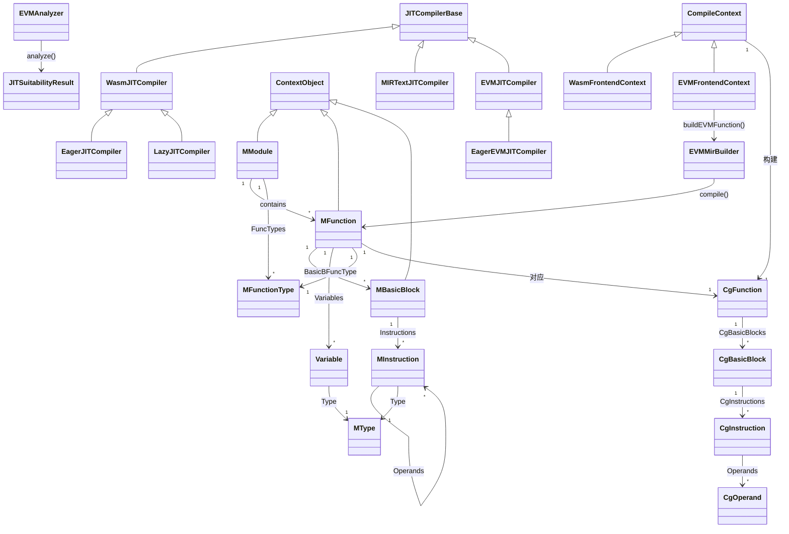

# compiler 模块数据模型

## 实体关系图 (Mermaid classDiagram)



---

## 核心实体 (关键字段和方法)

### 编译上下文

| 实体 | 关键字段 | 关键方法 |
|------|----------|----------|
| **CompileContext** | `MemPool`, `ThreadMemPool`, `CodeMPool`, `FuncTypeSet`, `PtrTypeSet`, `IntConstants`, `FPConstants`, `CodePtr`, `CodeSize`, `FuncOffsetMap`, `ExternRelocs`, `MCCtx`, `MCL` | `initialize()`, `finalize()`, `reinitialize()`, `getMCLowering()`, `getOrCreateFuncMCSymbol()` |
| **WasmFrontendContext** | 继承 `CompileContext`，引用 `runtime::Module` | 用于 WASM 前端 |
| **EVMFrontendContext** | `Bytecode`, `BytecodeSize`, `GasMeteringEnabled`, `GasChunkEnd`, `GasChunkCost`, `GasChunkSize`, `Revision`, `GasRegisterEnabled` | `setBytecode()`, `setGasMeteringEnabled()`, `setGasChunkInfo()`, `setRevision()`, `getMIRTypeFromEVMType()` |

### dMIR 层

| 实体 | 关键字段 | 关键方法 |
|------|----------|----------|
| **MModule** | `FuncTypes`, `Functions` | `addFuncType()`, `getFuncType()`, `addFunction()`, `getFunction()`, `getNumFunctions()` |
| **MFunction** | `FuncIdx`, `FuncType`, `Variables`, `BasicBlocks`, `Instructions`, `ExceptionSetBBs` | `createBasicBlock()`, `appendBlock()`, `createVariable()`, `createInstruction()`, `getGasRegisterVarIdx()`（EVM） |
| **MFunctionType** | `RetType`, `ParamTypes`（通过 `getSubTypes()` 存储） | `getNumParams()`, `param_begin()`, `param_end()`, `getReturnType()` |
| **MBasicBlock** | `Idx`, `Instructions`, `Successors` | `addSuccessor()`, `getIdx()` |
| **MInstruction** | `_opcode`, `_kind`, `_type`, `_operand_num`, `_parent`（BB 或父指令） | `getOpcode()`, `getKind()`, `getType()`, `getOperand()`, `setOperand()`, `isStatement()`, `isTerminator()` |
| **Variable** | `VarIdx`, `Type` | `getVarIdx()`, `getType()` |
| **MType** | 静态 `I8`, `I16`, `I32`, `I64`, `F32`, `F64`, `VOID` | - |

### CgIR 层

| 实体 | 关键字段 | 关键方法 |
|------|----------|----------|
| **CgFunction** | `MIRFunc`, `CgBasicBlocks`, `RegInfo`, `EvictAdvisor` | `createCgBasicBlock()`, `appendCgBasicBlock()`, `createCgInstruction()`, `getRegInfo()` |
| **CgBasicBlock** | `CgInstructions`, `Successors` | `addSuccessor()`, `getIdx()` |
| **CgInstruction** | 机器指令操作码、操作数列表 | `getOpcode()`, `getOperand()` |
| **CgOperand** | `createRegOperand()`, `createImmOperand()`, `createMemOperand()` | - |

### EVM 前端

| 实体 | 关键字段 | 关键方法 |
|------|----------|----------|
| **EVMAnalyzer** | `BlockInfos`, `JITResult`, `Revision` | `analyze()`, `getBlockInfos()`, `getJITSuitability()` |
| **EVMMirBuilder** | `Ctx`, `CurFunc`, `CurBB`, `InstanceAddr`, `JumpDestTable`, `JumpDestBodyTable`, `GasRegVar` | `compile()`, `loadEVMInstanceAttr()`, `meterOpcode()`, `handlePush()`, `handleMul()`, `handleShift()` 等 |
| **EVMMirBuilder::Operand** | `Instr`, `Var`, `Type`, `U256Components`, `U256VarComponents`, `ConstValue`, `IsConstant`, `IsU256MultiComponent` | `getInstr()`, `getVar()`, `getType()`, `getU256Components()`, `isU256MultiComponent()` |

### JIT 编译器

| 实体 | 关键字段 | 关键方法 |
|------|----------|----------|
| **JITCompilerBase** | - | `compileMIRToCgIR()`, `emitObjectBuffer()` |
| **WasmJITCompiler** | `WasmMod`, `NumInternalFunctions`, `Config`, `Stats` | `compileWasmToMC()` |
| **EagerJITCompiler** | - | `compile()` |
| **LazyJITCompiler** | `StubBuilder`, `MainContext`, `Mod`, `CompileStatuses`, `GreedyRACodePtrs`, `ThreadPool` | `compile()`, `dispatchCompileTask()`, `compileFunction()`, `compileFunctionOnRequest()` |
| **EVMJITCompiler** | `EVMMod`, `Config`, `Stats` | `compileEVMToMC()` |
| **EagerEVMJITCompiler** | - | `compile()` |

---

## 枚举

### EVMType（EVM 前端类型）

| 值 | 说明 |
|----|------|
| `VOID` | 无值 |
| `UINT8` | 字节 |
| `UINT32` | 中间值 |
| `UINT64` | Gas 计算 |
| `UINT256` | 主 256 位整数 |
| `BYTES32` | 32 字节固定数组 |
| `ADDRESS` | 20 字节地址 |
| `BYTES` | 动态字节数组 |

### MInstruction::Kind

| 值 | 说明 |
|----|------|
| `CONSTANT` | 常量 |
| `UNARY` | 一元运算 |
| `BINARY` | 二元运算 |
| `ADC` | 带进位加 |
| `CMP` | 比较 |
| `CONVERSION` | 类型转换 |
| `SELECT` | Select |
| `DREAD` | 读变量 |
| `LOAD` | 加载 |
| `OVERFLOW_I128_BINARY` | WASM 溢出二元 |
| `EVM_UMUL128` | EVM 128 位无符号乘 |
| `EVM_UMUL128_HI` | EVM 128 位乘高位 |
| `DASSIGN` | 赋值 |
| `STORE` | 存储 |
| `BR` | 无条件跳转 |
| `BR_IF` | 条件跳转 |
| `SWITCH` | 开关 |
| `RETURN` | 返回 |
| `WASM_CHECK` | WASM 检查 |
| `CALL` | 调用 |

### LazyJITCompiler::CompileStatus

| 值 | 说明 |
|----|------|
| `None` | 未编译 |
| `Pending` | 待编译 |
| `InProgress` | 编译中 |
| `Done` | 已完成 |

---

## DTO / 共享类型

### JITSuitabilityResult

```cpp
struct JITSuitabilityResult {
  bool ShouldFallback = false;
  size_t BytecodeSize = 0;
  size_t MirEstimate = 0;
  size_t RAExpensiveCount = 0;
  size_t MaxConsecutiveExpensive = 0;
  size_t MaxBlockExpensiveCount = 0;
  size_t DupFeedbackPatternCount = 0;
};
```

### EVMAnalyzer::BlockInfo

```cpp
struct BlockInfo {
  uint64_t EntryPC = 0;
  int32_t MaxStackHeight = 0;
  int32_t MinStackHeight = 0;
  int32_t MinPopHeight = 0;
  int32_t StackHeightDiff = 0;
  bool IsJumpDest = false;
  bool HasUndefinedInstr = false;
  uint32_t RAExpensiveCount = 0;
};
```

### CompileContext::ExternRelocations

```cpp
struct ExternRelocations {
  uint64_t Offset;
  int64_t Addend;
  uint32_t CalleeFuncIdx;
};
```

### FunctionTypeKeyInfo / PointerTypeKeyInfo

用于 `DenseSet` 去重 `MFunctionType`、`MPointerType` 的 key 与 hash。

### EVMMirBuilder::U256Value / U256Inst / U256Var / U256ConstInt

- `U256Value`：`std::array<uint64_t, 4>`，小端 [low, mid-low, mid-high, high]
- `U256Inst`：`std::array<MInstruction*, 4>`
- `U256Var`：`std::array<Variable*, 4>`
- `U256ConstInt`：`std::array<MConstantInt*, 4>`

### 类型别名（common_defs.h）

| 别名 | 定义 |
|------|------|
| `VariableIdx` | `uint32_t` |
| `OperandNum` | `uint16_t` |
| `BlockNum` | `uint32_t` |
| `CompileMemPool` | `MonotonicMemPool` |
| `CompileVector` | `std::vector<T, CompileAllocator<T>>` |
| `CompileUnorderedMap` | `std::unordered_map<... CompileAllocator<...>>` |

### RA-expensive 阈值常量（evm_analyzer.h）

| 常量 | 值 |
|------|-----|
| `MAX_JIT_BYTECODE_SIZE` | 0x6000 |
| `MAX_JIT_MIR_ESTIMATE` | 50000 |
| `MAX_CONSECUTIVE_RA_EXPENSIVE` | 128 |
| `MAX_BLOCK_RA_EXPENSIVE` | 256 |
| `MAX_DUP_FEEDBACK_PATTERN` | 64 |
