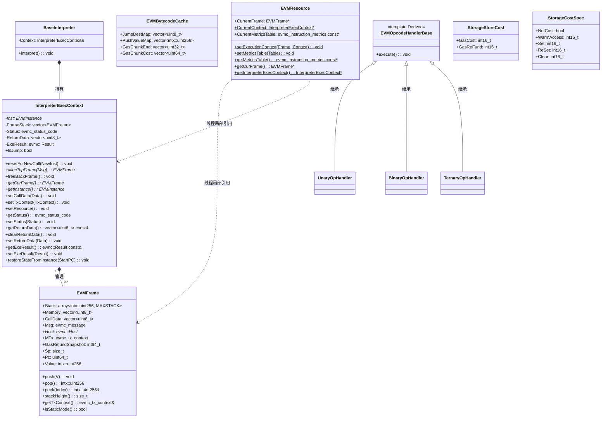

# evm 模块数据模型

## 实体关系图 (Mermaid classDiagram)

## 核心实体 (关键字段和方法)

### EVMFrame

单次 EVM 调用的执行帧。

| 字段 | 类型 | 说明 |
|------|------|------|
| Stack | `std::array<intx::uint256, MAXSTACK>` | 操作数栈，最大 1024 槽 |
| Memory | `std::vector<uint8_t>` | 可扩展字节内存 |
| CallData | `std::vector<uint8_t>` | 调用输入数据 |
| Msg | `evmc_message` | 当前消息（kind、depth、gas、recipient、sender、value 等） |
| Host | `evmc::Host*` | Host 接口指针 |
| MTx | `evmc_tx_context` | 交易上下文（懒加载） |
| GasRefundSnapshot | `int64_t` | 本帧创建时的 refund 快照 |
| Sp | `size_t` | 栈顶指针 |
| Pc | `uint64_t` | 程序计数器 |
| Value | `intx::uint256` | 当前 value（部分场景） |

### InterpreterExecContext

解释执行上下文，管理调用栈与执行状态。

| 方法 | 说明 |
|------|------|
| `allocTopFrame(Msg)` | 分配新帧并入栈 |
| `freeBackFrame()` | 弹出顶帧，将剩余 Gas 写回 Instance |
| `getCurFrame()` | 获取当前顶帧 |
| `setResource()` | 设置 EVMResource 的 Frame、Context、MetricsTable |
| `restoreStateFromInstance(StartPC)` | 从 EVMInstance 恢复栈、内存、PC，用于 JIT fallback |

### BaseInterpreter

解释器主循环，通过 `interpret()` 执行当前帧直至 STOP/RETURN/REVERT/异常。

### EVMBytecodeCache

字节码预分析缓存，由 `buildBytecodeCache()` 填充，供解释器与 JIT 使用。

| 字段 | 说明 |
|------|------|
| JumpDestMap | `[pc] -> 0/1` 有效 JUMPDEST |
| PushValueMap | `[pc] -> intx::uint256` PUSH 立即数 |
| GasChunkEnd | `[chunk_start_pc] -> chunk_end_pc` |
| GasChunkCost | `[chunk_start_pc] -> chunk_gas_cost` |

### EVMResource

线程局部静态访问点，供 opcode handler 获取当前 Frame、Context、MetricsTable，避免参数层层传递。

## 枚举

| 枚举 | 来源 | 说明 |
|------|------|------|
| `evmc_status_code` | evmc | EVMC_SUCCESS, EVMC_REVERT, EVMC_OUT_OF_GAS, EVMC_STACK_OVERFLOW, EVMC_STACK_UNDERFLOW, EVMC_UNDEFINED_INSTRUCTION, EVMC_INVALID_INSTRUCTION, EVMC_BAD_JUMP_DESTINATION, EVMC_INVALID_MEMORY_ACCESS, EVMC_STATIC_MODE_VIOLATION 等 |
| `evmc_revision` | evmc | EVMC_FRONTIER, EVMC_HOMESTEAD, ..., EVMC_CANCUN, EVMC_PRAGUE, EVMC_OSAKA, EVMC_EXPERIMENTAL |
| `evmc_opcode` | evmc | OP_STOP, OP_ADD, ..., OP_PUSH1~OP_PUSH32, OP_DUP1~OP_DUP16, OP_SWAP1~OP_SWAP16, OP_CALL, OP_CREATE, OP_CREATE2 等 |
| `evmc_storage_status` | evmc | EVMC_STORAGE_ADDED, EVMC_STORAGE_DELETED, EVMC_STORAGE_MODIFIED 等，用于 SSTORE 计费 |

## DTO / 共享类型

| 类型 | 定义位置 | 说明 |
|------|----------|------|
| `StorageStoreCost` | gas_storage_cost.h | `{ GasCost, GasReFund }`，SSTORE 计费结果 |
| `StorageCostSpec` | gas_storage_cost.cpp | `{ NetCost, WarmAccess, Set, ReSet, Clear }`，每修订版本存储规范 |
| `SSTORE_COSTS` | gas_storage_cost | `[evmc_revision][evmc_storage_status] -> StorageStoreCost` 查找表 |
| `STORAGE_COST_SPEC_TABLE` | gas_storage_cost.cpp | `[evmc_revision] -> StorageCostSpec` |
| `evmc_message` | evmc | 调用消息 |
| `evmc_tx_context` | evmc | 交易/区块上下文 |
| `evmc_instruction_metrics` | evmc | `{ gas_cost }` 单操作码 Gas |

### evm.h 常量

| 常量 | 值 | 说明 |
|------|-----|------|
| MAXSTACK | 1024 | 栈深度上限 |
| MAX_REQUIRED_MEMORY_SIZE | 16MB | 内存扩展上限 |
| DEFAULT_REVISION | EVMC_CANCUN | 默认修订版本 |
| BASIC_EXECUTION_COST | 21000 | 基础交易 Gas |
| COLD_ACCOUNT_ACCESS_COST | 2600 | EIP-2929 冷账户访问 |
| WARM_ACCOUNT_ACCESS_COST | 100 | 热账户访问 |
| MAX_CODE_SIZE | 0x6000 | EIP-170 合约代码大小上限 |
| MAX_SIZE_OF_INITCODE | 0xC000 | EIP-3860 initcode 大小上限 |
| EMPTY_CODE_HASH | 固定 32 字节 | 空代码 Keccak256 |

### gas_storage_cost.h 常量

| 常量 | 值 | 说明 |
|------|-----|------|
| COLD_SLOAD_COST | 2100 | 冷 SLOAD |
| WARM_STORAGE_READ_COST | 100 | 热存储读 |
| WORD_COPY_COST | 3 | 拷贝字成本 |
| SSTORE_REQUIRED_ISTANBUL | 2300 | Istanbul 后 SSTORE 最低 Gas |
