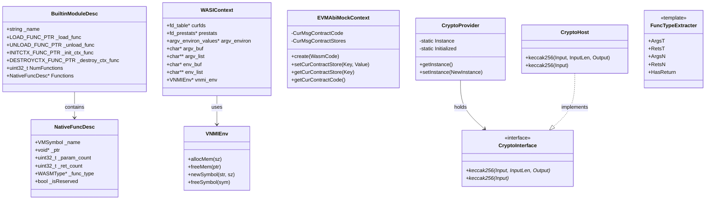

# host 模块数据模型

## 实体关系图 (Mermaid classDiagram)



## 核心实体 (关键字段和方法)

### BuiltinModuleDesc

宿主模块描述符，由 runtime 加载。

| 字段 | 类型 | 说明 |
|------|------|------|
| `_name` | `const char*` | 模块名，如 "env"、"wasi_snapshot_preview1"、"spectest" |
| `_load_func` | `LOAD_FUNC_PTR` | 加载时分配 `NativeFuncDesc` 数组并填充函数信息 |
| `_unload_func` | `UNLOAD_FUNC_PTR` | 卸载时释放符号和函数类型内存 |
| `_init_ctx_func` | `INITCTX_FUNC_PTR` | 实例化时创建模块上下文，返回 `void*` 或 `nullptr` |
| `_destroy_ctx_func` | `DESTROYCTX_FUNC_PTR` | 实例销毁时释放上下文 |
| `NumFunctions` | `uint32_t` | C-API 预留 |
| `Functions` | `NativeFuncDesc*` | C-API 预留 |

### NativeFuncDesc

单个宿主函数的元数据。

| 字段 | 类型 | 说明 |
|------|------|------|
| `_name` | `VMSymbol` | 符号 ID，由 `newSymbol` 创建 |
| `_ptr` | `void*` | 函数指针 |
| `_param_count` | `uint32_t` | 参数个数 |
| `_ret_count` | `uint32_t` | 返回值个数 |
| `_func_type` | `WASMType*` | 参数和返回值的 WASM 类型数组 |
| `_isReserved` | `bool` | 是否为保留函数（vnmi_init_ctx / vnmi_destroy_ctx） |

### WASIContext

WASI 模块的实例级上下文，由 `vnmi_init_ctx` 创建。

| 字段 | 类型 | 说明 |
|------|------|------|
| `curfds` | `fd_table*` | WASM fd 到原生 fd 的映射表 |
| `prestats` | `fd_prestats*` | 预打开目录的预统计信息 |
| `argv_environ` | `argv_environ_values*` | 命令行参数和环境变量 |
| `argv_buf` | `char*` | argv 字符串缓冲区 |
| `argv_list` | `char**` | argv 指针数组 |
| `env_buf` | `char*` | 环境变量字符串缓冲区 |
| `env_list` | `char**` | 环境变量指针数组 |
| `vnmi_env` | `VNMIEnv*` | 用于 allocMem/freeMem |

### EVMAbiMockContext

EVM ABI Mock 模块的合约级上下文。

| 方法 | 签名 | 说明 |
|------|------|------|
| `create` | `static shared_ptr create(vector<uint8_t>& WasmCode)` | 用 4 字节大端长度前缀包装 Wasm 代码，创建上下文 |
| `setCurContractStore` | `void setCurContractStore(const string& Key, const vector<uint8_t>& Value)` | 设置存储槽，Key 为 bytes32 hex（无 0x） |
| `getCurContractStore` | `const vector<uint8_t>& getCurContractStore(const string& Key)` | 读取存储槽，未找到返回 32 字节零 |
| `getCurContractCode` | `const vector<uint8_t>& getCurContractCode()` | 返回当前合约代码（含前缀） |

### CryptoInterface / CryptoHost / CryptoProvider

EVM Keccak-256 密码学抽象。

| 类 | 方法 | 说明 |
|----|------|------|
| `CryptoInterface` | `keccak256(Input, InputLen, Output)` | 纯虚，计算哈希写入 Output（至少 32 字节） |
| `CryptoInterface` | `keccak256(Input)` | 纯虚，返回 32 字节 vector |
| `CryptoHost` | 同上 | 使用 `ethash::keccak256` 实现 |
| `CryptoProvider` | `getInstance()` | 单例获取，懒初始化 |
| `CryptoProvider` | `setInstance(unique_ptr)` | 注入自定义实现 |

## 枚举

### WASI 相关（来自 wasmtime_ssp.h）

| 枚举/宏 | 值示例 | 说明 |
|--------|--------|------|
| `__wasi_errno_t` | `__WASI_ESUCCESS`, `__WASI_EBADF`, `__WASI_EFAULT` 等 | WASI 错误码 |
| `__wasi_clockid_t` | `__WASI_CLOCK_REALTIME`, `__WASI_CLOCK_MONOTONIC` | 时钟 ID |
| `__wasi_filetype_t` | `__WASI_FILETYPE_DIRECTORY`, `__WASI_FILETYPE_REGULAR_FILE` | 文件类型 |
| `__wasi_fdflags_t` | `__WASI_FDFLAG_APPEND`, `__WASI_FDFLAG_SYNC` | 文件描述符标志 |
| `__wasi_whence_t` | `__WASI_WHENCE_SET`, `__WASI_WHENCE_CUR`, `__WASI_WHENCE_END` | seek 基准 |
| `__wasi_preopentype_t` | `__WASI_PREOPENTYPE_DIR` | 预打开类型 |
| `__wasi_signal_t` | `__WASI_SIGKILL`, `__WASI_SIGSEGV` 等 | 信号编号 |

### ErrorCode（common 模块，host 使用）

| 值 | 说明 |
|----|------|
| `EnvAbort` | 宿主 API 异常终止 |
| `WASIProcRaise` | WASI proc_raise 收到信号 |
| `InstanceExit` | 实例正常或通过 finish 退出 |

## DTO / 共享类型

### wasi_prestat_app_t

WASI 预打开目录信息的应用侧布局（32 位兼容）。

```c
typedef struct wasi_prestat_app {
  wasi_preopentype_t pr_type;
  uint32_t pr_name_len;
} wasi_prestat_app_t;
```

### iovec_app_t

WASI iovec/ciovec 的应用侧布局（使用偏移而非指针）。

```c
typedef struct iovec_app {
  uint32_t buf_offset;
  uint32_t buf_len;
} iovec_app_t;
```

### ethash_hash256

Keccak-256 输出类型（来自 hash_types.h）。

```c
union ethash_hash256 {
  uint64_t word64s[4];
  uint32_t word32s[8];
  uint8_t bytes[32];
  char str[32];
};
```

### VNMI 保留函数签名

```c
typedef void *(*VNMI_RESERVED_INIT_CTX_TYPE)(
    VNMIEnv *vmenv, const char *dir_list[], uint32_t dir_count,
    const char *envs[], uint32_t env_count, char *env_buf,
    uint32_t env_buf_size, char *argv[], uint32_t argc, char *argv_buf,
    uint32_t argv_buf_size);
typedef void (*VNMI_RESERVED_DESTROY_CTX_TYPE)(VNMIEnv *vmenv, void *ctx);
```
