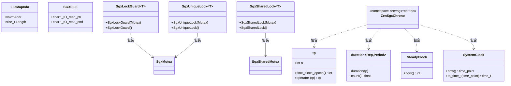

# platform 模块数据模型

## 实体关系图

## 核心实体

### FileMapInfo

**位置**: `map.h`，命名空间 `zen::platform`

| 字段 | 类型 | 说明 |
|------|------|------|
| `Addr` | `void *` | 映射区域的起始地址 |
| `Length` | `size_t` | 映射区域的字节长度 |

表示一次 `mapFile` 成功后的映射结果，供 `unmapFile` 使用。

---

### SGXFILE

**位置**: `sgx/zen_sgx_file.h`（C 类型）

| 字段 | 类型 | 说明 |
|------|------|------|
| `_IO_read_ptr` | `char *` | 当前读指针 |
| `_IO_read_end` | `char *` | 读缓冲区结束位置 |

SGX 环境下的类 FILE 句柄，用于替换 `std::FILE`。全局实例：`sgx_stdout`、`sgx_stderr`。

---

### SgxMutex / SgxSharedMutex

**位置**: `sgx/zen_sgx_thread.h`

空类，作为 SGX 下互斥锁和读写锁的占位类型，无成员。与 `std::mutex`、`std::shared_timed_mutex` 接口不兼容，仅用于类型别名统一。

---

### SgxLockGuard\<Mutex\> / SgxSharedLock\<Mutex\> / SgxUniqueLock\<Mutex\>

**位置**: `sgx/zen_sgx_thread.h`

| 类 | 构造 |
|----|------|
| `SgxLockGuard` | `SgxLockGuard(Mutex Mtx)`、`SgxLockGuard()` |
| `SgxSharedLock` | `SgxSharedLock(Mutex Mtx)`、`SgxSharedLock()` |
| `SgxUniqueLock` | `SgxUniqueLock(Mutex Mtx)`、`SgxUniqueLock()` |

SGX 下的 RAII 锁守卫占位，构造后不执行加锁，无析构逻辑。

---

### zen::sgx::chrono

**位置**: `sgx/zen_sgx_time.h`

SGX 下的 `std::chrono` 替代命名空间，提供简化版时间类型：

| 类型 | 说明 |
|------|------|
| `tp` | 时间点，含 `int n`；`time_since_epoch()` 返回 0；支持 `operator-` |
| `duration<Rep, Period>` | 时长，构造自 `tp`，`count()` 返回 0.0 |
| `milliseconds` | `uint64_t count()` 返回 0 |
| `SteadyClock` | `time_point` 为 `tp`，`now()` 返回 0 |
| `SystemClock` | `time_point` 为 `tp`，`now()` 返回默认 `time_point`，`to_time_t` 返回 0 |
| `duration_cast<T>(int v)` | 返回 `T{}` |

主要用于编译通过，实际时间语义由宿主或上层提供。

## 枚举

### 内存保护与映射标志

**位置**: `sgx/zen_sgx_mman.h`（匿名枚举）

| 名称 | 值 | 说明 |
|------|-----|------|
| `PROT_NONE` | 0 | 不可访问 |
| `PROT_READ` | 1 | 可读 |
| `PROT_WRITE` | 2 | 可写 |
| `PROT_EXEC` | 4 | 可执行 |

**位置**: `sgx/zen_sgx_mman.h`（宏）

| 名称 | 值 | 说明 |
|------|-----|------|
| `MAP_FILE` | 0x0 | 文件映射（默认） |
| `MAP_SHARED` | 0x01 | 共享映射 |
| `MAP_PRIVATE` | 0x02 | 私有写时复制 |
| `MAP_ANONYMOUS` | 0x20 | 匿名映射 |
| `MAP_FAILED` | `(void *)-1` | `mmap` 失败返回值（`zen_sgx_map.cpp` 中定义） |

### 文件打开与模式（`zen_sgx_file.h`）

| 宏类别 | 示例 | 说明 |
|--------|------|------|
| `O_RDONLY` / `O_WRONLY` / `O_RDWR` | 00 / 01 / 02 | 打开模式 |
| `O_CREAT` / `O_TRUNC` / `O_APPEND` 等 | 多种 | 打开选项 |
| `S_IFREG` / `S_IFDIR` 等 | 0170000 等 | 文件类型 |
| `SEEK_SET` / `SEEK_CUR` / `SEEK_END` | 0 / 1 / 2 |  Seek 基准 |

完整集合见 `zen_sgx_file.h`。

## DTO / 共享类型

| 类型 | 定义位置 | 用途 |
|------|----------|------|
| `FileMapInfo` | `map.h` | 跨 `mapFile` / `unmapFile` 传递映射信息 |
| `SGXFILE` | `zen_sgx_file.h` | SGX 下替代 `std::FILE`，供 `STDFile` 别名使用 |
| `zen::common::Byte` | `platform.h`（来自 libcxx 或 std） | 字节类型 |
| `zen::common::Bytes` | `platform.h` | `basic_string_view<Byte>` |
| `zen::common::StringView` | `platform.h` | `string_view` |
| `zen::common::Optional<T>` | `platform.h` | `optional<T>` |
| `zen::common::Variant<T...>` | `platform.h` | `variant<T...>` |

以上类型通过 `platform.h` 或 `map.h` 对外暴露，供 `common`、`runtime`、`compiler`、`evm`、`singlepass`、`utils` 等模块使用。
