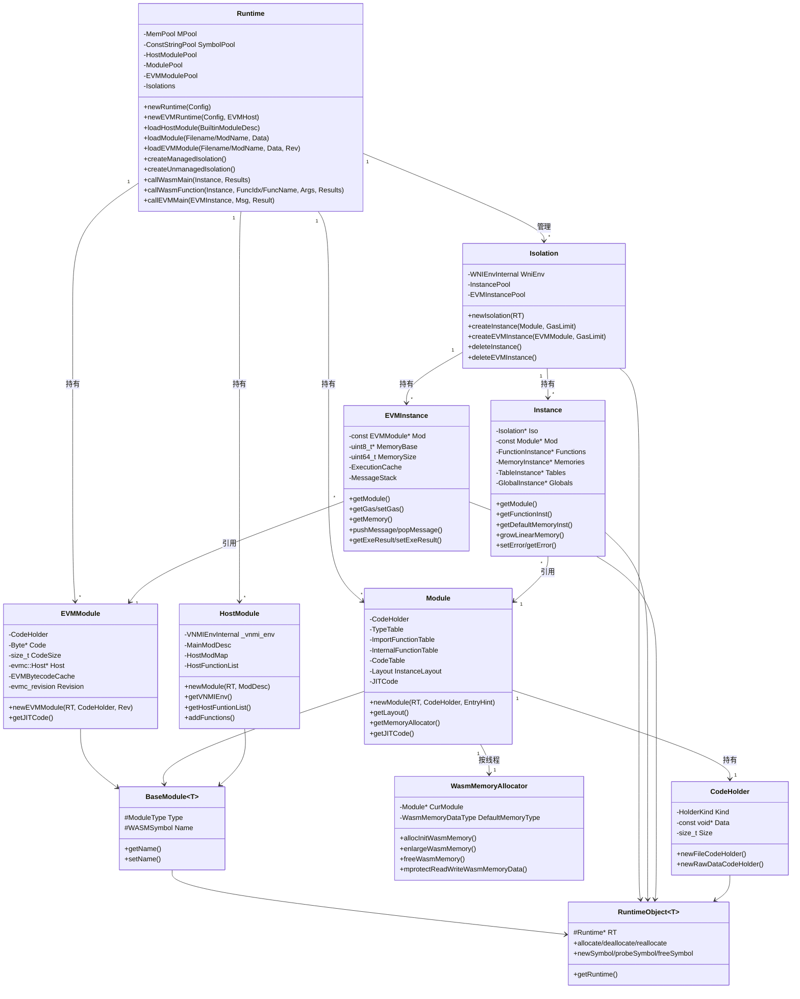

# runtime 模块数据模型

## 实体关系图 (Mermaid classDiagram)



## 核心实体 (关键字段和方法)

### Runtime

| 字段/方法 | 说明 |
|----------|------|
| `MPool` | 系统内存池 (SysMemPool) |
| `SymbolPool` | 常量字符串池 (ConstStringPool) |
| `HostModulePool` | `WASMSymbol -> HostModuleUniquePtr` |
| `ModulePool` | `WASMSymbol -> ModuleUniquePtr` |
| `EVMModulePool` | `EVMSymbol -> EVMModuleUniquePtr`（ZEN_ENABLE_EVM） |
| `Isolations` | `Isolation* -> IsolationUniquePtr` |
| `EVMHost` | evmc::Host*（ZEN_ENABLE_EVM） |
| `VMMaxMemPages` | VM 最大线性内存页数 |
| `Config` | RuntimeConfig |

### Module

| 字段/方法 | 说明 |
|----------|------|
| `TypeTable` | TypeEntry* |
| `ImportFunctionTable` | ImportFunctionEntry* |
| `InternalFunctionTable` | FuncEntry* |
| `CodeTable` | CodeEntry* |
| `Layout` | InstanceLayout，计算 Instance 内存布局 |
| `JITCode` / `JITCodeSize` | JIT 编译产物（ZEN_ENABLE_JIT） |
| `ThreadLocalMemAllocatorMap` | 线程 -> WasmMemoryAllocator* |

### Instance

| 字段/方法 | 说明 |
|----------|------|
| `Mod` | 关联 Module |
| `Iso` | 关联 Isolation |
| `Functions` | FunctionInstance 数组 |
| `Memories` | MemoryInstance 数组 |
| `Tables` | TableInstance 数组 |
| `Globals` | GlobalInstance 数组 |
| `GlobalVarData` | 全局变量存储区 |
| `Err` | common::Error |
| `Gas` | Gas 限制/剩余 |
| `JITFuncPtrs` / `FuncTypeIdxs` | JIT 元数据（ZEN_ENABLE_JIT） |

### EVMInstance

| 字段/方法 | 说明 |
|----------|------|
| `Mod` | 关联 EVMModule |
| `Memory` | std::unique_ptr<uint8_t[]> |
| `MemoryBase` / `MemorySize` | 当前内存基址与大小 |
| `EVMStack` | uint8_t[EVMStackCapacity] |
| `CurrentMessage` / `MessageStack` | evmc_message 调用栈 |
| `ExeResult` | evmc::Result |
| `InstanceExecutionCache` | ExecutionCache（TxContext、BlockHashes 等） |
| `Gas` / `GasRefund` | Gas 与退款 |

### Isolation

| 字段/方法 | 说明 |
|----------|------|
| `WniEnv` | WNIEnvInternal（WNI 环境） |
| `InstancePool` | Instance* -> InstanceUniquePtr |
| `EVMInstancePool` | EVMInstance* -> EVMInstanceUniquePtr（ZEN_ENABLE_EVM） |

### WasmMemoryAllocator

| 字段/方法 | 说明 |
|----------|------|
| `CurModule` | 关联 Module |
| `DefaultMemoryType` | WasmMemoryDataType |
| `ActiveBuckets` | MmapBucketInstance 映射 |
| `allocInitWasmMemory()` | 分配初始线性内存 |
| `enlargeWasmMemory()` | 扩展内存 |
| `freeWasmMemory()` | 释放内存 |

## 枚举

### ModuleType

```cpp
enum class ModuleType { WASM, EVM, JIT, AOT, NATIVE };
```

### FunctionKind

```cpp
enum FunctionKind { ByteCode = 0, Jit, Aot, Native };
```

### WasmMemoryDataType

```cpp
enum WasmMemoryDataType : uint32_t {
  WM_MEMORY_DATA_TYPE_NO_DATA = 0,
  WM_MEMORY_DATA_TYPE_MALLOC = 1,
  WM_MEMORY_DATA_TYPE_SINGLE_MMAP = 2,
  WM_MEMORY_DATA_TYPE_BUCKET_MMAP = 3,
};
```

### CodeHolder::HolderKind

```cpp
enum class HolderKind { kFile, kRawData };
```

## DTO / 共享类型

### VNMIEnvInternal

```cpp
typedef struct VNMIEnvInternal_ {
  VNMIEnv _env;
  Runtime *_runtime;
} VNMIEnvInternal;
```

### WNIEnvInternal

```cpp
typedef struct WNIEnvInternal_ {
  WNIEnv _env;
  Runtime *_runtime;
} WNIEnvInternal;
```

### BuiltinModuleDesc（来自 vnmi.h）

| 字段 | 说明 |
|-----|------|
| `_name` | 模块名 |
| `_load_func` | LOAD_FUNC_PTR |
| `_unload_func` | UNLOAD_FUNC_PTR |
| `_init_ctx_func` | INITCTX_FUNC_PTR |
| `_destroy_ctx_func` | DESTROYCTX_FUNC_PTR |
| `Functions` | NativeFuncDesc* |
| `NumFunctions` | 函数数量 |

### NativeFuncDesc（来自 vnmi.h）

| 字段 | 说明 |
|-----|------|
| `_name` | VMSymbol 函数名 |
| `_ptr` | 函数指针 |
| `_func_type` | WASMType* |
| `_param_count` | 参数个数 |
| `_ret_count` | 返回值个数 |
| `_isReserved` | 是否保留 |

### WasmMemoryData

```cpp
struct WasmMemoryData {
  WasmMemoryDataType Type;
  uint8_t *MemoryData;
  size_t MemorySize;
  bool NeedMprotect;
};
```

### FunctionInstance

| 字段 | 说明 |
|-----|------|
| `NumParams` / `NumLocals` | 参数/局部变量数量 |
| `MaxStackSize` / `MaxBlockDepth` | 栈与块深度 |
| `Kind` | FunctionKind |
| `CodePtr` | 字节码指针 |
| `JITCodePtr` | JIT 代码指针（ZEN_ENABLE_JIT） |
| `ReturnTypes` / `ParamTypes` | 类型信息 |

### MemoryInstance

| 字段 | 说明 |
|-----|------|
| `CurPages` / `MaxPages` | 当前/最大页数 |
| `MemSize` | 字节大小 |
| `MemBase` / `MemEnd` | 基址与结束地址 |
| `Kind` | WasmMemoryDataType |

### TableInstance

| 字段 | 说明 |
|-----|------|
| `CurSize` / `MaxSize` | 当前/最大元素数 |
| `Elements` | uint32_t* 表项 |

### GlobalInstance

| 字段 | 说明 |
|-----|------|
| `Type` | WASMType |
| `Mutable` | 是否可变 |
| `Offset` | 在 GlobalVarData 中的偏移 |

### RuntimeConfig

| 字段 | 说明 |
|-----|------|
| `Format` | common::InputFormat |
| `Mode` | common::RunMode |
| `DisableWasmMemoryMap` | 是否禁用 mmap |
| `EnableStatistics` | 是否启用统计 |
| `DisableWASI` | 是否禁用 WASI（ZEN_ENABLE_BUILTIN_WASI） |
| `EnableMultipassLazy` | Multipass 惰性编译（ZEN_ENABLE_MULTIPASS_JIT） |

### RuntimeObjectDestroyer 与 UniquePtr 类型

```cpp
template <typename T> using RuntimeObjectUniquePtr = std::unique_ptr<T, RuntimeObjectDestroyer>;
using CodeHolderUniquePtr = RuntimeObjectUniquePtr<CodeHolder>;
using HostModuleUniquePtr = RuntimeObjectUniquePtr<HostModule>;
using ModuleUniquePtr = RuntimeObjectUniquePtr<Module>;
using InstanceUniquePtr = RuntimeObjectUniquePtr<Instance>;
using IsolationUniquePtr = RuntimeObjectUniquePtr<Isolation>;
using EVMModuleUniquePtr = RuntimeObjectUniquePtr<EVMModule>;  // ZEN_ENABLE_EVM
using EVMInstanceUniquePtr = RuntimeObjectUniquePtr<EVMInstance>;  // ZEN_ENABLE_EVM
```
