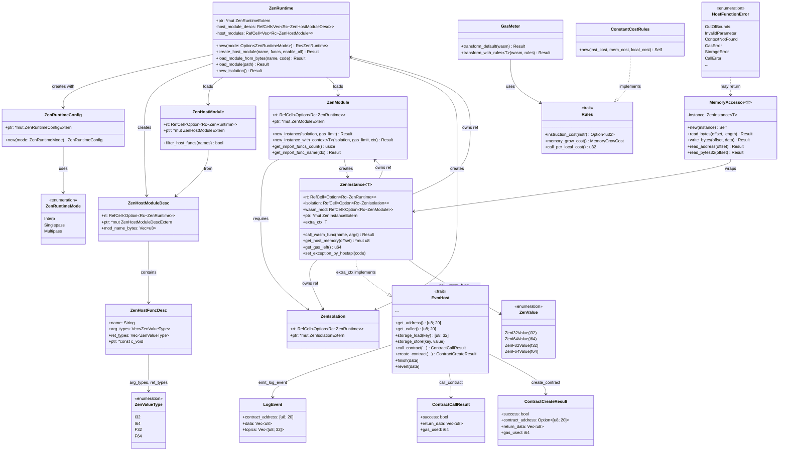

# rust-bindings 模块数据模型

## 实体关系图 (Mermaid classDiagram)

## 核心实体

### ZenRuntime

运行时入口，持有 `ZenRuntimeExtern*`。负责创建宿主模块、加载 WASM 模块、创建隔离与实例。默认模式为 Singlepass。

| 字段 | 类型 | 说明 |
|------|------|------|
| ptr | `*mut ZenRuntimeExtern` | C 运行时指针 |
| host_module_descs | `RefCell<Vec<Rc<ZenHostModuleDesc>>>` | 宿主模块描述，需在 runtime 释放前存活 |
| host_modules | `RefCell<Vec<Rc<ZenHostModule>>>` | 已加载的宿主模块 |

### ZenModule

WASM 模块封装，从文件或字节加载。可创建带 Gas 限制的实例，支持泛型上下文 `T`。

| 字段 | 类型 | 说明 |
|------|------|------|
| rt | `RefCell<Option<Rc<ZenRuntime>>>` | 所属运行时 |
| ptr | `*mut ZenModuleExtern` | C 模块指针 |

### ZenInstance&lt;T&gt;

WASM 实例，持有执行上下文。`T` 为 `extra_ctx`，通常实现 `EvmHost`。通过 `ZenSetInstanceCustomData` 将自身指针存入 C 实例，供宿主函数通过 `ZenInstance::from_raw_pointer` 取回。

| 字段 | 类型 | 说明 |
|------|------|------|
| ptr | `*mut ZenInstanceExtern` | C 实例指针 |
| extra_ctx | `T` | 用户上下文（如 MockContext） |
| rt, isolation, wasm_mod | `RefCell<Option<Rc<...>>>` | 依赖资源引用 |

### ZenHostFuncDesc

宿主函数描述，用于向运行时注册。`ptr` 为 `extern "C" fn(*mut ZenInstanceExtern, ...)` 形式的函数指针。

| 字段 | 类型 | 说明 |
|------|------|------|
| name | `String` | 导出名（如 `getAddress`） |
| arg_types | `Vec<ZenValueType>` | 参数类型 |
| ret_types | `Vec<ZenValueType>` | 返回类型 |
| ptr | `*const c_void` | C 函数指针 |

## 枚举

### ZenRuntimeMode

| 变体 | C 值 | 说明 |
|------|------|------|
| Interp | 0 | 解释器模式 |
| Singlepass | 1 | Singlepass JIT |
| Multipass | 2 | Multipass JIT |

### ZenValueType

| 变体 | C 值 | 说明 |
|------|------|------|
| I32 | 0 | 32 位整数 |
| I64 | 1 | 64 位整数 |
| F32 | 2 | 32 位浮点 |
| F64 | 3 | 64 位浮点 |

### ZenValue

| 变体 | 说明 |
|------|------|
| ZenI32Value(i32) | i32 值 |
| ZenI64Value(i64) | i64 值 |
| ZenF32Value(f32) | f32 值 |
| ZenF64Value(f64) | f64 值 |

### HostFunctionError

| 变体 | 关联字段 | 说明 |
|------|----------|------|
| OutOfBounds | offset, length, message, function | 内存越界 |
| InvalidParameter | param, value, message, function | 无效参数 |
| ContextNotFound | message, function | 上下文缺失 |
| MemoryAccessError | message, function | 内存访问错误 |
| ExecutionError | message, function | 执行错误 |
| GasError | message, function, gas_requested, gas_available | Gas 错误 |
| StorageError | message, function, key | 存储错误 |
| CallError | message, function, target_address | 调用错误 |
| CryptoError | message, function, operation | 密码学错误 |
| ArithmeticError | message, function, operation | 算术错误 |

### MemoryGrowCost

| 变体 | 说明 |
|------|------|
| Free | 不按页计费 |
| Linear(NonZeroU32) | 每页固定 Gas 成本 |

### TransformError

| 变体 | 说明 |
|------|------|
| Parse(elements::Error) | WASM 解析失败 |
| Inject(String) | Gas 注入失败 |
| Serialize(elements::Error) | WASM 序列化失败 |

## DTO / 共享类型

### ZenRuntimeConfigExtern / ZenRuntimeExtern / ZenModuleExtern / ZenIsolationExtern / ZenInstanceExtern

`#[repr(C)]` 的 FFI 不透明句柄，由 C 库分配与释放。

### ZenHostFuncDescExtern

| 字段 | 类型 | 说明 |
|------|------|------|
| name | `*const c_char` | 函数名 C 字符串 |
| num_args | `uint32_t` | 参数个数 |
| arg_types | `*const uint32_t` | 参数类型数组 |
| num_returns | `uint32_t` | 返回值个数 |
| ret_types | `*const uint32_t` | 返回类型数组 |
| ptr | `*const c_void` | 函数指针 |

### ZenValueExtern

| 字段 | 类型 | 说明 |
|------|------|------|
| value_type | `c_int` | 0=i32, 1=i64, 2=f32, 3=f64 |
| value | `int64_t` | 值（联合体语义） |

### LogEvent

| 字段 | 类型 | 说明 |
|------|------|------|
| contract_address | `[u8; 20]` | 合约地址 |
| data | `Vec<u8>` | 日志数据 |
| topics | `Vec<[u8; 32]>` | 主题（最多 4 个） |

### ContractCallResult

| 字段 | 类型 | 说明 |
|------|------|------|
| success | `bool` | 是否成功 |
| return_data | `Vec<u8>` | 返回数据 |
| gas_used | `i64` | 消耗 Gas |

### ContractCreateResult

| 字段 | 类型 | 说明 |
|------|------|------|
| success | `bool` | 是否成功 |
| contract_address | `Option<[u8; 20]>` | 创建的合约地址 |
| return_data | `Vec<u8>` | 返回数据 |
| gas_used | `i64` | 消耗 Gas |

### ScopedMalloc&lt;T&gt;

RAII 封装的 `libc::malloc`，Drop 时自动 `free`。

### MeteredBlock（gas_inject）

| 字段 | 类型 | 说明 |
|------|------|------|
| start_pos | `usize` | 注入位置 |
| cost | `u64` | Gas 成本 |
