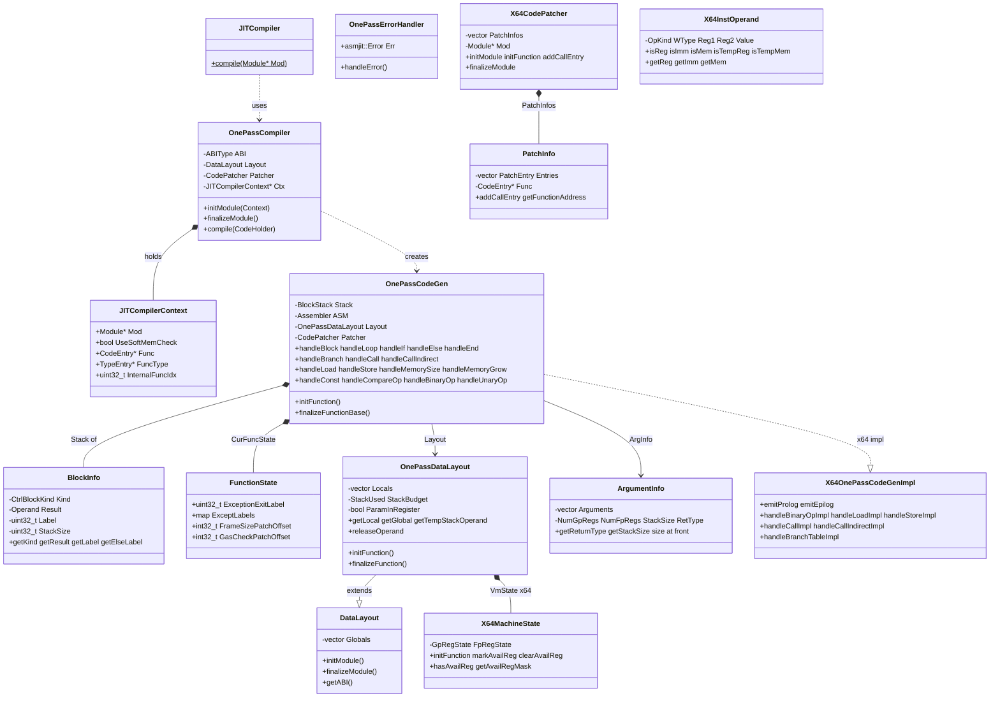

# singlepass 模块数据模型

## 实体关系图 (Mermaid classDiagram)

## 核心实体 (关键字段和方法)

### JITCompiler

| 成员 | 类型 | 说明 |
|------|------|------|
| `compile(Module *Mod)` | static void | 唯一对外接口，将模块内所有内部函数编译为 JIT 代码 |

### JITCompilerContext

| 字段 | 类型 | 说明 |
|------|------|------|
| `Mod` | `Module*` | 当前编译的 WASM 模块 |
| `UseSoftMemCheck` | `bool` | 是否使用软件内存边界检查 |
| `Func` | `CodeEntry*` | 当前编译函数的代码条目 |
| `FuncType` | `TypeEntry*` | 当前函数的类型信息 |
| `InternalFuncIdx` | `uint32_t` | 内部函数索引（不含导入） |

### OnePassCodeGen / BlockInfo

| 实体 | 关键成员 | 说明 |
|------|----------|------|
| `BlockInfo` | `Kind` | CtrlBlockKind: FUNC_ENTRY / BLOCK / LOOP / IF |
| | `Result` | 块结果操作数 |
| | `Label` | 块结束标签；IF 时 Label+1 为 else 标签 |
| | `StackSize` | 块对应的栈大小 |

### FunctionState

| 字段 | 类型 | 说明 |
|------|------|------|
| `ExceptionExitLabel` | `uint32_t` | 异常出口标签 |
| `ExceptLabels` | `map<ErrorCode, asmjit::Label>` | 各错误码对应陷阱标签 |
| `FrameSizePatchOffset` | `int32_t` | prolog 中帧大小补丁偏移 |
| `GasCheckPatchOffset` | `int32_t` | Gas 检查补丁偏移（若使用） |

### X64OnePassDataLayout / LocalInfo

| 实体 | 关键成员 | 说明 |
|------|----------|------|
| `LocalInfo` | `Type` | WASM 类型 |
| | `Reg` | 寄存器号（若在寄存器中） |
| | `Offset` | 栈帧偏移（若在栈上） |
| `X64OnePassDataLayout` | `VmState` | X64MachineState，跟踪寄存器可用性 |
| | `StackIncrement` | 栈增长步长 32 字节 |

### X64CodePatcher / PatchInfo

| 实体 | 关键成员 | 说明 |
|------|----------|------|
| `PatchEntry` | `PatKind` | PKCall |
| | `Ofst` | 补丁偏移（24bit） |
| | `PatSize` | 补丁大小（最大 15 字节） |
| | `PatArg` | 被调函数内部索引 |
| `X64CodePatcher` | `finalizeModule()` | 遍历 PatchInfo，写入 call rel32 编码 |

### X64MachineState

| 字段 | 类型 | 说明 |
|------|------|------|
| `GpRegParamState` | 6bit | 整数参数是否在寄存器 |
| `FpRegParamState` | 8bit | 浮点参数是否在寄存器 |
| `NativeStackSize` | 18bit | 本机栈大小 |
| `GpRegState` | 16bit | 整数临时寄存器可用性 |
| `FpRegState` | 16bit | 浮点临时寄存器可用性 |

### X64InstOperand

| 字段 | 类型 | 说明 |
|------|------|------|
| `OpKind` | `uint8_t` | X64OperandKind 与 OperandFlags 组合 |
| `WType` | `WASMType` | WASM 值类型 |
| `Reg1` | `uint8_t` | 主寄存器/基址寄存器 |
| `Reg2` | `uint8_t` | 索引寄存器（SIB 形式） |
| `Value` | `int32_t` | 立即数或偏移 |

## 枚举

### CtrlBlockKind

| 值 | 含义 |
|----|------|
| `FUNC_ENTRY` | 函数入口块 |
| `BLOCK` | 普通 block |
| `LOOP` | loop 块 |
| `IF` | if 块 |

### X64OperandKind

| 值 | 含义 |
|----|------|
| `OK_None` | 无操作数 |
| `OK_Register` | 寄存器 |
| `OK_IntConst` | 32 位整数立即数 |
| `OK_BaseOffset` | 基址加偏移 |
| `OK_BaseIndexScale1/2/4/8` | 基址加索引乘 scale 加偏移 |
| `OK_Label` | 标签 |
| `OK_Function` | 函数 |

### X64InstOperand::OperandFlags

| 值 | 含义 |
|----|------|
| `FLAG_NONE` | 无标记 |
| `FLAG_TEMP_MEM` | 栈上临时 |
| `FLAG_TEMP_REG` | 临时寄存器 |

### PatchInfo::PatchKind

| 值 | 含义 |
|----|------|
| `PKCall` | 直接调用补丁 |

### X64::Type

| 值 | 含义 |
|----|------|
| `I8` | 8 位整数 |
| `I16` | 16 位整数 |
| `I32` | 32 位整数 |
| `I64` | 64 位整数 |
| `F32` | 32 位浮点 |
| `F64` | 64 位浮点 |
| `V128` | 128 位向量 |
| `VOID` | 占位 |

### ScopedTempReg 索引

| 值 | 含义 |
|----|------|
| `ScopedTempReg0` | 0 |
| `ScopedTempReg1` | 1 |
| `ScopedTempReg2` | 2 |
| `ScopedTempRegLast` | 3 |

## DTO / 共享类型

### ArgumentInfo::Argument

| 字段 | 类型 | 说明 |
|------|------|------|
| `Type` | `WASMType` | 形式参数类型 |
| `Reg` | `RegNumType` | 参数寄存器号 |
| `Offset` | `uint16_t` | 栈上偏移 |

### DataLayout::GlobalInfo

| 字段 | 类型 | 说明 |
|------|------|------|
| `Type` | `WASMType` | 全局变量类型 |
| `Mutable` | `bool` | 是否可变 |
| `Offset` | `uint32_t` | 相对 global_data 的偏移 |

### OnePassDataLayout::LocalInfo

| 字段 | 类型 | 说明 |
|------|------|------|
| `Type` | `WASMType` | 局部变量类型 |
| `Reg` | `uint32_t` | 寄存器号（InvalidParamReg 表示在栈上） |
| `Offset` | `int32_t` | 栈帧偏移 |

### FloatAttr (WASMType::F32 / F64)

模板特化，提供浮点转整数边界常量：

| 静态成员 | 说明 |
|----------|------|
| `IntType` | 对应整数类型 I32 或 I64 |
| `NegZero` | 负零位模式 |
| `CanonicalNan` | 规范 NaN 位模式 |
| `SignMask` | 符号位掩码 |
| `int_max<Int>()` / `int_min<Int>()` | 有符号边界 |
| `uint_max<Int>()` / `uint_min<Int>()` | 无符号边界 |

### Instance 偏移常量 (OnePassCodeGen 中)

| 常量 | 值 | 说明 |
|------|-----|------|
| `GlobalBaseOffset` | offsetof(Instance, GlobalVarData) | 全局数据基址 |
| `MemoriesOffset` | offsetof(Instance, Memories) | 内存数组 |
| `MemoryBaseOffset` | offsetof(MemoryInstance, MemBase) | 内存基址 |
| `MemorySizeOffset` | offsetof(MemoryInstance, MemSize) | 内存大小 |
| `TablesOffset` | offsetof(Instance, Tables) | 表数组 |
| `TableSizeOffset` | offsetof(TableInstance, CurSize) | 表大小 |
| `TableBaseOffset` | offsetof(TableInstance, Elements) | 表元素基址 |
| `FunctionPointersOffset` | offsetof(Instance, JITFuncPtrs) | JIT 函数指针数组 |
| `ExceptionOffset` | offsetof(Instance, Err.ErrCode) | 异常码 |
| `StackBoundaryOffset` | offsetof(Instance, JITStackBoundary) | 栈边界 |
| `GasLeftOffset` | offsetof(Instance, Gas) | 剩余 Gas |
