# tests 模块数据模型

## 实体关系图 (Mermaid classDiagram)

```mermaid
classDiagram
    class SpecTest {
        +CommandID resolveCommand(name)
        +enumerate() vector
        +findFilePath(category, unit, filename) string
        +compare(expected, got) bool
        +run(unitPair)
        +OnInstantiate ModuleCallback
        +OnTrapInstantiate InstantiateCallback
        +OnInvoke InvokeCallback
        -TestsuiteRoot path
        -Config RuntimeConfig
    }

    class CommandID {
        <<enumeration>>
        Unknown
        Module
        Action
        Register
        AssertReturn
        AssertTrap
        AssertExhaustion
        AssertMalformed
        AssertInvalid
        AssertUnlinkable
        AssertUninstantiable
    }

    class ParsedAccount {
        +address Address
        +Account MockedAccount
    }

    class ParsedTransaction {
        +TxContext evmc_tx_context
        +Message evmc_message ptr
        +CallData vector~uint8_t~
        +AccessList vector~AccessListEntry~
        +BlobHashes vector~bytes32~
        +MaxFeePerBlobGas optional~uint256be~
        +AuthorizationListSize size_t
    }

    class AccessListEntry {
        +Address address
        +StorageKeys vector~bytes32~
    }

    class StateTestFixture {
        +TestName string
        +PreState vector~ParsedAccount~
        +Environment evmc_tx_context
        +Transaction Document ptr
        +Post Document ptr
    }

    class ForkPostResult {
        +ExpectedHash string
        +ExpectedLogs string
        +ExpectedException string
        +ExpectedTxBytes vector~uint8_t~
        +Indexes Data/Gas/Value
        +ExpectedState Document ptr
    }

    class SolidityTestCase {
        +Name string
        +Function string
        +Expected string
        +Contract string
        +Calldata string
    }

    class SolcContractData {
        +DeployBytecode string
        +RuntimeBytecode string
    }

    class SolidityContractTestData {
        +ContractPath string
        +TestCases vector~SolidityTestCase~
        +ContractDataMap map~string,SolcContractData~
        +MainContract string
        +DeployContracts vector~string~
        +ConstructorArgs map
    }

    class EVMTestEnvironment {
        +Runtime Runtime ptr
        +TempMockedHost MockedHost ptr
        +Host ZenMockedEVMHost ptr
        +MockedHost ZenMockedEVMHost*
        +DeployerAddr address
    }

    class DeployedContract {
        +Instance EVMInstance*
        +Address address
        +RuntimeBytecode string
    }

    class ExpectedResult {
        +Status string
        +ErrorCode uint8_t
        +Stack vector~string~
        +Memory string
        +Storage map~string,string~
        +TransientStorage map~string,string~
        +ReturnValue string
        +Events vector~string~
    }

    class TempHexFile {
        -FilePath string
        -Valid bool
        +isValid() bool
        +getPath() string
    }

    class ZenMockedEVMHost {
        +AccountInitEntry AccountInitEntry
        +AccessListEntry AccessListEntry
        +TransactionExecutionConfig TransactionExecutionConfig
        +TransactionExecutionResult TransactionExecutionResult
        +loadInitialState()
        +setRuntime()/getRuntime()
    }

    SpecTest --> CommandID : uses
    StateTestFixture --> ParsedAccount : contains
    StateTestFixture --> ForkPostResult : post per fork
    ParsedTransaction --> AccessListEntry : contains
    SolidityContractTestData --> SolidityTestCase : contains
    SolidityContractTestData --> SolcContractData : references
    EVMTestEnvironment --> DeployedContract : deploys
```



## 核心实体

### SpecTest

WAST 规范测试驱动，枚举并执行 `(category, unit)` 对。

| 字段/方法 | 类型 | 说明 |
|-----------|------|------|
| TestsuiteRoot | filesystem::path | 测试套件根目录 |
| Config | RuntimeConfig | 运行时配置（RunMode 等） |
| enumerate() | vector\<pair\<string,string\>\> | 枚举测试用例 |
| findFilePath() | string | 按 category/unit 查找文件 |
| compare() / compares() | bool | 比较期望与实际结果 |
| OnInstantiate | ModuleCallback | 模块加载回调 |
| OnInvoke | InvokeCallback | 函数调用回调 |

### StateTestFixture

Ethereum State 测试用例，对应 JSON 中单个测试条目。

| 字段 | 类型 | 说明 |
|------|------|------|
| TestName | string | 测试名称（JSON key） |
| PreState | vector\<ParsedAccount\> | 预置账户状态 |
| Environment | evmc_tx_context | 区块/交易环境 |
| Transaction | unique_ptr\<rapidjson::Document\> | 交易定义 |
| Post | unique_ptr\<rapidjson::Document\> | 期望结果（按 fork 索引） |

### ParsedAccount

从 JSON `pre` 解析的账户。

| 字段 | 类型 | 说明 |
|------|------|------|
| Address | evmc::address | 20 字节地址 |
| Account | evmc::MockedAccount | nonce、balance、code、storage、codehash |

### ParsedTransaction

从 State JSON `transaction` + `post` indexes 构建的交易。

| 字段 | 类型 | 说明 |
|------|------|------|
| TxContext | evmc_tx_context | 交易上下文 |
| Message | unique_ptr\<evmc_message\> | 调用消息 |
| CallData | vector\<uint8_t\> | 输入数据 |
| AccessList | vector\<AccessListEntry\> | EIP-2930 访问列表 |
| BlobHashes | vector\<evmc::bytes32\> | EIP-4844 blob 哈希 |
| MaxFeePerBlobGas | optional\<evmc::uint256be\> | blob gas 费用 |
| AuthorizationListSize | size_t | EIP-7702 授权列表大小 |

### ForkPostResult

单个 fork 的期望结果。

| 字段 | 类型 | 说明 |
|------|------|------|
| ExpectedHash | string | 状态根哈希 |
| ExpectedLogs | string | 日志哈希 |
| ExpectedException | string | 期望异常 |
| ExpectedTxBytes | vector\<uint8_t\> | 序列化交易 |
| Indexes | struct | Data/Gas/Value 索引 |
| ExpectedState | shared_ptr\<Document\> | 期望账户状态 JSON |

### SolidityContractTestData

Solidity 合约测试目录的完整数据结构。

| 字段 | 类型 | 说明 |
|------|------|------|
| ContractPath | string | 合约路径 |
| TestCases | vector\<SolidityTestCase\> | 测试用例 |
| ContractDataMap | map\<string,SolcContractData\> | 合约名 → 字节码 |
| MainContract | string | 主合约名 |
| DeployContracts | vector\<string\> | 需部署的合约列表 |
| ConstructorArgs | map\<...\> | 构造函数参数 |

### ExpectedResult（EVM Interp）

EVM 单操作码测试的期望输出（YAML 解析）。

| 字段 | 类型 | 说明 |
|------|------|------|
| Status | string | SUCCESS/REVERT 等 |
| ErrorCode | uint8_t | 错误码 |
| Stack | vector\<string\> | 栈元素（hex） |
| Memory | string | 内存（hex） |
| Storage | map | 存储槽 → 值 |
| TransientStorage | map | 瞬态存储 |
| ReturnValue | string | 返回值 |
| Events | vector\<string\> | 事件 |

## 枚举

### SpecTest::CommandID

| 值 | 说明 |
|----|------|
| Unknown | 未知命令 |
| Module | 加载模块 |
| Action | 执行动作 |
| Register | 注册别名 |
| AssertReturn | 断言返回值 |
| AssertTrap | 断言陷阱 |
| AssertExhaustion | 断言资源耗尽 |
| AssertMalformed | 断言格式错误 |
| AssertInvalid | 断言无效 |
| AssertUnlinkable | 断言不可链接 |
| AssertUninstantiable | 断言不可实例化 |

## DTO / 共享类型

### ZenMockedEVMHost::AccountInitEntry

```cpp
struct AccountInitEntry {
  evmc::address Address{};
  evmc::MockedAccount Account{};
};
```

### ZenMockedEVMHost::TransactionExecutionConfig

```cpp
struct TransactionExecutionConfig {
  std::string ModuleName;
  const uint8_t *Bytecode;
  size_t BytecodeSize;
  evmc_message Message;
  uint64_t GasLimit;
  uint64_t GasLimitMultiplier;
  uint64_t IntrinsicGas;
  std::optional<evmc::uint256be> MaxPriorityFeePerGas;
  std::optional<evmc::uint256be> MaxFeePerBlobGas;
  std::vector<AccessListEntry> AccessList;
  evmc_revision Revision;
};
```

### ZenMockedEVMHost::TransactionExecutionResult

```cpp
struct TransactionExecutionResult {
  bool Success;
  uint64_t GasUsed;
  uint64_t GasCharged;
  uint64_t GasRefund;
  int64_t RemainingGas;
  evmc_status_code Status;
  std::string ErrorMessage;
};
```

### AbiEncoded（Solidity 辅助）

```cpp
struct AbiEncoded {
  std::string StaticPart;
  std::string DynamicPart;
};
```

### ContractDirectoryInfo

```cpp
struct ContractDirectoryInfo {
  std::string FolderName;
  std::filesystem::path SolcJsonFile;
  std::filesystem::path CasesFile;
};
```
