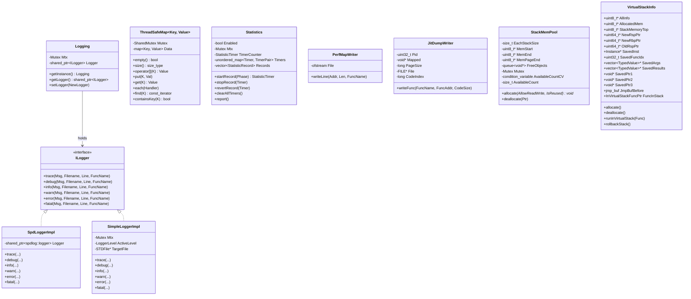

# utils 模块数据模型

## 实体关系图

## 核心实体

### Logging

| 字段/方法 | 类型 | 说明 |
|-----------|------|------|
| `getInstance()` | `static Logging&` | 单例访问 |
| `getLogger()` | `std::shared_ptr<ILogger>` | 当前 logger，可能为空 |
| `setLogger(NewLogger)` | `void` | 线程安全替换 logger |
| `Mtx` | `common::Mutex` | 保护 Logger 切换 |
| `Logger` | `std::shared_ptr<ILogger>` | 当前实现 |

### ILogger

纯虚接口，定义六级日志方法，签名均为 `(const std::string& Msg, const char* Filename, int Line, const char* FuncName)`。

### ThreadSafeMap\<Key, Value\>

| 字段/方法 | 类型 | 说明 |
|-----------|------|------|
| `Mutex` | `common::SharedMutex` | 读写锁 |
| `Data` | `std::map<Key, Value, Compare, Alloc>` | 底层存储 |
| `empty()`, `size()` | 读锁 | 与 map 语义一致 |
| `operator[]`, `put`, `get`, `insert`, `emplace`, `erase`, `clear` | 写锁 | 写操作 |
| `at`, `find`, `containsKey`, `count`, `lowerBound`, `upperBound`, `each` | 读锁 | 读操作 |

### Statistics

| 字段/方法 | 类型 | 说明 |
|-----------|------|------|
| `Enabled` | `bool` | 是否收集统计 |
| `Mtx` | `common::Mutex` | 保护 Timers/Records |
| `TimerCounter` | `StatisticTimer` (uint32_t) | 自增计时器 ID |
| `Timers` | `unordered_map<StatisticTimer, TimerPair>` | 活跃计时器 |
| `Records` | `vector<pair<StatisticPhase, float>>` | 已完成的阶段耗时(ms) |
| `startRecord(Phase)` | 返回 Timer | 开始计时 |
| `stopRecord(Timer)` | 写入 Records 并移除 Timer | 结束计时 |
| `revertRecord(Timer)` | 移除 Timer | 取消计时 |
| `report()` | 汇总并输出到日志 | 只读 |

### PerfMapWriter

| 字段/方法 | 类型 | 说明 |
|-----------|------|------|
| `File` | `std::ofstream` | 输出流 |
| `FilenameFormat` | `"/tmp/perf-%d.map"` | 文件名模板 |
| `writeLine(Addr, Len, FuncName)` | `void` | 写入一行 map 条目 |

### JitDumpWriter

| 字段/方法 | 类型 | 说明 |
|-----------|------|------|
| `Pid` | `uint32_t` | 进程 ID |
| `Mapped` | `void*` | mmap 映射区（供 perf 读取） |
| `PageSize` | `long` | 页大小 |
| `File` | `FILE*` | 二进制写入 |
| `CodeIndex` | `long` | 代码段序号 |
| `writeFunc(FuncName, FuncAddr, CodeSize)` | `void` | 写入 JIT_CODE_LOAD 记录 |

### StackMemPool

| 字段/方法 | 类型 | 说明 |
|-----------|------|------|
| `EachStackSize` | `size_t` | 单块栈大小（约 18MB） |
| `MemStart`, `MemEnd`, `MemPageEnd` | `uint8_t*` | 可分配区间 |
| `FreeObjects` | `std::queue<void*>` | 回收栈块 |
| `Mutex` | `common::Mutex` | 保护分配 |
| `AvailableCountCV` | `condition_variable` | 等待可用块 |
| `AvailableCount` | `size_t` | 剩余可分配数量，上限 MAX_STACK_ITEM_NUM |
| `allocate(AllowReadWrite, IsReused)` | `void*` | 分配一块栈 |
| `deallocate(Ptr)` | `void` | 归还栈块 |

### VirtualStackInfo

| 字段/方法 | 类型 | 说明 |
|-----------|------|------|
| `AllInfo` | `uint8_t*` | 元数据区（含 NewRsp/OldRsp 等） |
| `AllocatedMem` | `uint8_t*` | 从 StackMemPool 分配的内存 |
| `StackMemoryTop` | `uint8_t*` | 栈顶（低地址端） |
| `NewRspPtr`, `OldRspPtr`, `NewRbpPtr` | `uint64_t*` | RSP/RBP 指针 |
| `SavedInst` | `Instance*` | WASM 实例（EVM 模式下为 nullptr） |
| `SavedFuncIdx` | `uint32_t` | 函数索引 |
| `SavedArgs`, `SavedResults` | `vector<TypedValue>*` | 参数与返回值 |
| `SavedPtr1`, `SavedPtr2`, `SavedPtr3` | `void*` | EVM 扩展（EVMInstance、evmc_message、Result） |
| `JmpBufBefore` | `jmp_buf` | setjmp 缓冲区 |
| `FuncInStack` | `InVirtualStackFuncPtr` | 要在虚拟栈中执行的函数 |
| `allocate()` / `deallocate()` | | 从池中分配/释放 |
| `runInVirtualStack(Func)` | | 切换栈并执行 Func |
| `rollbackStack()` | | 恢复原栈并 longjmp |

## 枚举

### LoggerLevel

| 值 | 说明 |
|----|------|
| Trace | 最细粒度 |
| Debug | 调试 |
| Info | 一般信息 |
| Warn | 警告 |
| Error | 错误 |
| Fatal | 致命错误 |
| Off | 关闭日志 |

### StatisticPhase

| 值 | 说明 |
|----|------|
| Load (0) | 模块加载 |
| JITCompilation (1) | JIT 编译 |
| JITLazyPrecompilation (2) | JIT 懒预编译 |
| JITLazyFgCompilation (3) | 前台懒编译 |
| JITLazyBgCompilation (4) | 后台懒编译 |
| JITLazyReleaseDelay (5) | 懒释放延迟 |
| MemoryBucketMap (6) | 内存桶映射 |
| Instantiation (7) | 实例化 |
| Execution (8) | 执行 |
| NumStatisticPhases | 阶段总数 |

### RecordType（perf JitDump）

| 值 | 说明 |
|----|------|
| JIT_CODE_LOEAD (0) | Code Load 记录（注意拼写为 LOEAD） |

## DTO / 共享类型

| 类型 | 定义位置 | 说明 |
|------|----------|------|
| `TimerPair` | Statistics 内部 | `pair<StatisticPhase, TimePoint>` |
| `StatisticRecord` | Statistics 内部 | `pair<StatisticPhase, float>` |
| `Header` | perf.cpp | JitDump 文件头（Magic、Version、Size、ElfMach、Pid、Timestamp） |
| `RecordHeader` | perf.cpp | 记录头（Type、TotalSize、Timestamp） |
| `RecordCodeLoad` | perf.cpp | Code Load 记录体（Pid、Tid、Vma、CodeAddr、CodeSize、CodeIndex） |
| `common::TypedValue` | common/type.h | WASM 类型值，含 `UntypedValue` 与 `WASMType` |
| `evmc::address` | evmc | 20 字节地址 |
| `evmc::bytes32` | evmc | 32 字节 |
| `evmc::uint256be` | evmc | 大端 256 位整数 |
| `filesystem` | filesystem.h | `std::filesystem` 或 `std::experimental::filesystem` 别名 |

## 常量

| 常量 | 值 | 说明 |
|------|-----|------|
| `MAX_STACK_ITEM_NUM` | 100 | StackMemPool 最大栈块数量 |
| `MaxCodeSize` | INT32_MAX / 640MB(Occlum) | 虚拟栈映射总大小 |
| `StackMemorySize` | 9 * 1024 * 1024 | 单块虚拟栈大小 9MB |
| `MAX_TRACE_LENGTH` | 16 | 回溯最大帧数（定义于 common/defines.h） |
| `RLP_OFFSET_SHORT_STRING` | 0x80 | RLP 短串偏移 |
| `RLP_OFFSET_SHORT_LIST` | 0xc0 | RLP 短列表偏移 |
| `HEX_CHARS` | "0123456789ABCDEF" | 十六进制字符表 |
