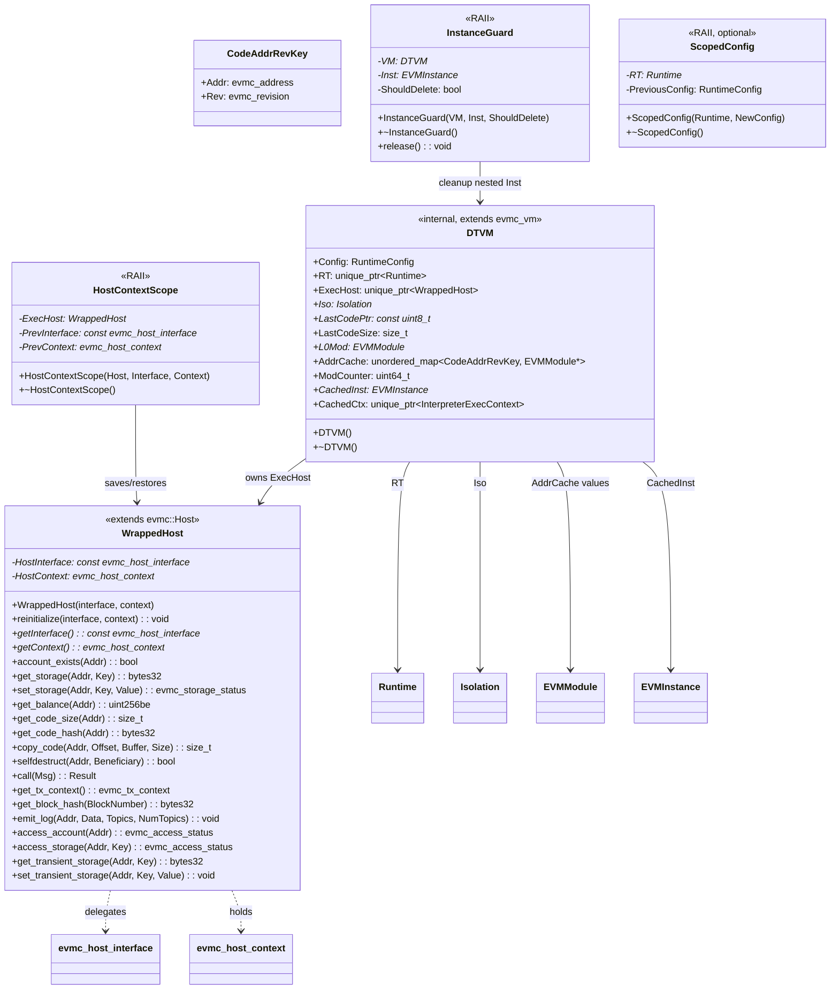

# vm-interface 模块数据模型

## 实体关系图 (Mermaid classDiagram)

## 核心实体

### DTVM

内部 VM 实现类，继承 `evmc_vm`（C 结构体），实现 EVMC 接口的 C++ 侧逻辑。

| 字段 / 方法     | 类型 | 说明 |
|-----------------|------|------|
| Config          | RuntimeConfig | 运行时配置（Format=EVM，Mode，EnableEvmGasMetering） |
| RT              | std::unique_ptr\<Runtime\> | EVM Runtime，负责模块加载与托管隔离 |
| ExecHost        | std::unique_ptr\<WrappedHost\> | Host 桥接实例，每次 execute 前 reinitialize |
| Iso             | Isolation *   | 托管隔离，持有 EVMInstance 池 |
| LastCodePtr     | const uint8_t * | L0 缓存（已禁用）状态，用于驱逐一致性 |
| LastCodeSize    | size_t        | 同上 |
| L0Mod           | EVMModule *   | L0 缓存模块引用，驱逐时置空 |
| AddrCache       | unordered_map\<CodeAddrRevKey, EVMModule*\> | L1 地址缓存 |
| ModCounter      | uint64_t      | 模块命名递增计数器（mod_0, mod_1, ...） |
| CachedInst      | EVMInstance * | 顶层调用复用的 EVM 实例 |
| CachedCtx       | unique_ptr\<InterpreterExecContext\> | 解释器模式复用的执行上下文 |
| destroy()       | 静态函数      | evmc_vm::destroy 回调，delete DTVM |
| execute()       | 静态函数      | evmc_vm::execute 回调 |
| get_capabilities() | 静态函数   | 返回 EVMC_CAPABILITY_EVM1 |
| set_option()    | 静态函数      | 解析 mode、enable_gas_metering |

### WrappedHost

将 C 风格 `evmc_host_interface` 与 `evmc_host_context` 桥接到 C++ `evmc::Host`。

| 字段 / 方法     | 类型 | 说明 |
|-----------------|------|------|
| HostInterface   | const evmc_host_interface * | 客户端提供的 C 接口函数表 |
| HostContext     | evmc_host_context * | 客户端提供的上下文指针 |
| reinitialize()  | void | 运行时切换 Host 接口与上下文 |
| getInterface()  | const evmc_host_interface * | 只读访问 |
| getContext()    | evmc_host_context * | 只读访问 |
| *（Host 虚方法）| —    | account_exists、get_storage、set_storage、get_balance、copy_code、call、get_tx_context、get_block_hash、emit_log、access_account、access_storage、get_transient_storage、set_transient_storage、selfdestruct |

### CodeAddrRevKey

L1 地址缓存的键类型。

| 字段 | 类型 | 说明 |
|------|------|------|
| Addr | evmc_address | 合约 code 地址（20 字节） |
| Rev  | evmc_revision | EVM 修订版本（如 CANCUN、SHANGHAI） |

### HostContextScope

RAII 辅助类，在 execute 入口保存当前 Host 上下文，退出时恢复。

| 字段 | 类型 | 说明 |
|------|------|------|
| ExecHost     | WrappedHost * | 被管理的 Host 实例 |
| PrevInterface| const evmc_host_interface * | 进入前保存的接口 |
| PrevContext  | evmc_host_context * | 进入前保存的上下文 |

### InstanceGuard

RAII 辅助类，确保嵌套调用创建的临时 `EVMInstance` 在退出时（含异常）被 `deleteEVMInstance` 释放。

| 字段 | 类型 | 说明 |
|------|------|------|
| VM           | DTVM * | 所属 VM，用于访问 Iso |
| Inst         | EVMInstance * | 待释放的临时实例 |
| ShouldDelete | bool   | 是否在析构时执行删除 |
| release()    | void   | 放弃删除责任 |

### ScopedConfig

RAII 辅助类（可选，用于 JIT fallback），临时切换 RuntimeConfig，析构时恢复。

## 枚举

| 枚举 | 来源 | 说明 |
|------|------|------|
| evmc_revision | evmc | EVM 修订版本（FRONTIER、HOMESTEAD、…、CANCUN 等） |
| evmc_status_code | evmc | 执行状态（EVMC_SUCCESS、EVMC_FAILURE、EVMC_OUT_OF_GAS 等） |
| evmc_set_option_result | evmc | set_option 返回值（EVMC_SET_OPTION_SUCCESS、EVMC_SET_OPTION_INVALID_NAME、EVMC_SET_OPTION_INVALID_VALUE） |
| evmc_capabilities_flagset | evmc | 能力位集（EVMC_CAPABILITY_EVM1） |
| evmc_storage_status | evmc | 存储写状态 |
| evmc_access_status | evmc | EIP-2929 访问状态 |
| RunMode | common::enums | InterpMode、MultipassMode 等 |
| InputFormat | common::enums | EVM、WASM |

## DTO / 共享类型

| 类型 | 来源 | 说明 |
|------|------|------|
| evmc_vm | evmc | VM 实例 C 结构体，含 abi_version、name、version、函数指针 |
| evmc_host_interface | evmc | Host 函数表（account_exists、get_storage、call 等） |
| evmc_host_context | evmc | 不透明上下文指针 |
| evmc_message | evmc | 调用消息（kind、flags、depth、gas、sender、destination、value、input 等） |
| evmc_result | evmc | 执行结果（status_code、gas_left、output_data、release） |
| evmc_address | evmc | 20 字节地址 |
| evmc_bytes32 | evmc | 32 字节数据 |
| evmc_tx_context | evmc | 交易上下文（block、timestamp、gas_price 等） |
| RuntimeConfig | runtime | Format、Mode、EnableEvmGasMetering 等 |
| CodeAddrRevHash | 内部 | CodeAddrRevKey 的哈希仿函数 |
| CodeAddrRevEqual | 内部 | CodeAddrRevKey 的相等仿函数 |

## 外部依赖类型（evmc 库）

- `evmc::Host`：C++ Host 接口基类
- `evmc::Result`：C++ 结果封装，含 `release_raw()` 释放所有权
- `evmc_make_result()`：构造失败用 evmc_result
- `EVMC_EXPORT`：符号导出宏
- `EVMC_ABI_VERSION`：ABI 版本常量（12）
